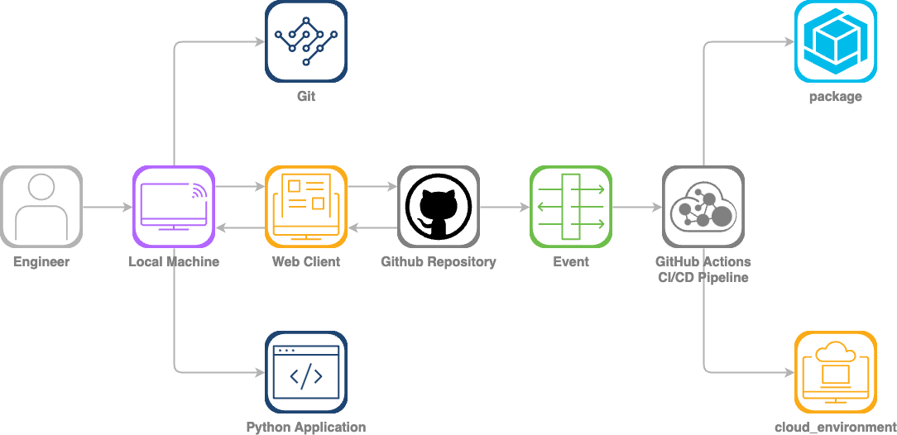
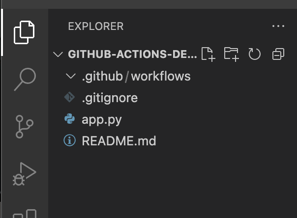
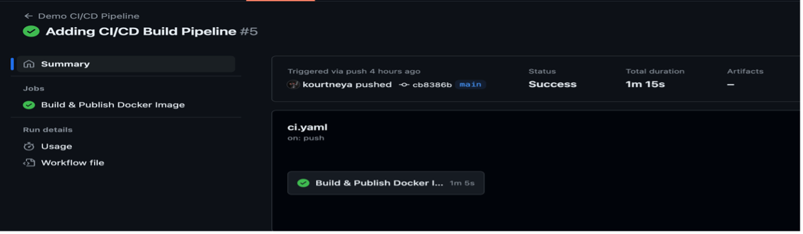
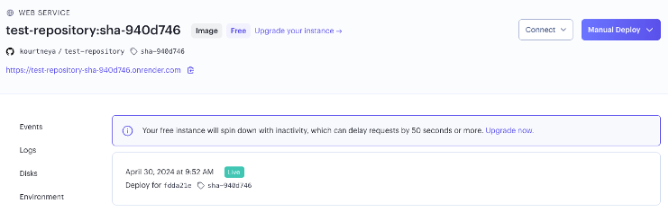
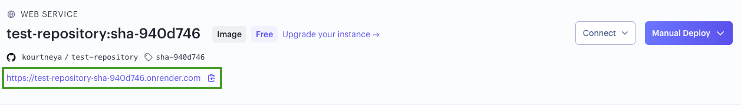
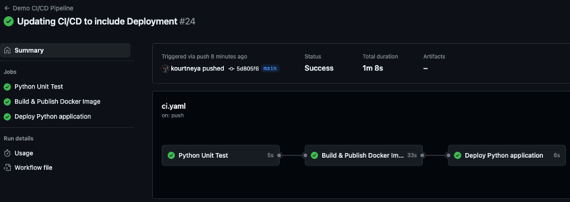

# Let's Automate With GitHub Actions

This lab session is designed to help you gain hands-on experience and equip you with practical skills while preparing for the DevNet Associate Certification. In the rapid evolving industry of software development, having CI/CD experience is essential for streamlining the delivery of reliable and high-quality applications. CI/CD automation saves time and reduce manual operations when integrating code changes, testing features, and deploying them to production. Most importantly, CI/CD will assist in gaining experience with new concepts and tools such as version control (e.g. Git), build automation (e.g. GitHub Actions), containerization (e.g. Docker), and other cloud native DevOps tools.

## Learning Objectives
Upon completion of this lab, you will be able to:

- Use and Understand Basic Git Functions
- Initialize a GitHub Repository
- Create a YAML document
- Containerize a Python Applications
- Understand CI/CD fundamentals
- Configure a CI/CD Pipeline with GitHub Actions

## Scenario
In this lab activity, you will have gained practical skills in setting up a CI/CD pipeline for a Python application. You will create a small application and leverage GitHub Actions, a powerful CI/CD automation tool, to implement a robust CI/CD pipeline that will seamlessly integrate with your GitHub repository. In the CI/CD pipeline you will create an automation to build, test, and deploy your application. You will utilize a version control system in Git to publish your changes to the repository that will kick off the CI/CD automation. You will also have gain experience in containerization by building a docker image to deploy the python application. 

By the end of this lab, not only will you be able to understand the core principles of CI/CD, you’ll also have gained hands-on experience in software design basics, containerization, and configuring and customizing a DevOps workflow. Nevertheless, you’ll be equipped with valuable skills that are applicable to preparing you for the DevNet Associate Certification.

Throughout the lab feel free to experiment with different configurations to deepen your understanding. The goal is not to just complete the task but to really grasps the concept.

## Workflow Diagram

  ghaction-lab

## Lab Requirements 
- Visual Studio Code (Text Editor)
- Git (Version Control System)
- Docker 


## Disclaimer

This lab is not intended to be a practice exam for the DevNet Associate exam. It's intended to help with gaining hands on experience with a few of the software development skills and give exposure to the concept of CI/CD which are objectives for the exam.


## Let's Automate!!

---

# Task 1 - GitHub Login/Sign Up

In this task you will need to login to your GitHub account. GitHub is the code repository where you will store your code, CI/CD pipeline, and run the automated workflows. Don't have an account? No worries, steps are provided to create a new and free account. 

## Step 1: Navigate to GitHub
In a new browser tab, type [https://github.com](https://github.com) or simple click the hyperlink to open in a new tab. 

## Step 2a: For Existing GitHub Account Users 
1. On the home page, click the `Sign In` button at the top right corner of the page. 

2. When prompt, enter user **Username** and **Password**

3. Click the `Sign In` button. 

4. Proceed to [Task 2 - Create Repository](task_2.md)

## Step 2b. For New GitHub Account Users
1. On the homepage click the `Sign Up` button next to the `Sign In` button.

2. Fill in form details

3. If prompt, GitHub may send an email to the email address you specified for verification. Login to your email account and follow the instructions for verification. 

<br>

**Congratulations!!** You now have a GitHub account.

---

# Task 2 - Create Repository
The goal of this task is to create a repository within GitHub that will store and keep track of the changes for the files inserted in this location. A GitHub Repository is the main place where developers share, collaborate, track issues, and maintain code in an organized and efficient way. 

## Step 1: Navigate to Your Profile 
1. Once you are logged in, click on your profile in the top right corner of the webpage. 
    > **NOTE:** To login or sign up for a GitHub account, please follow the instructions in [Task 1](task_1.md).

2. From the drop down menu, click `Your Repositories`

## Step 2: Create New Repository
1. On the repositories page, click the green button that's labeled `New`

2. Fill in required repository details, 
    1. **Repository Name:** Enter a name for the repository (e.g github-actions-demo)
    > Name should be unique and contain no spaces

    2. **Visibility:** indicates who can view the repository. Leave the `Public` radio button selected. 
        > **Public:** indicates anyone will have visibility to the information within the repository. Only you and collaborators you invites can make changes to the code within the repository 

        > **Private:** will only be visible to you and the collaborators you invite. Only you and the collaborators you invite can make changes to the code within the repository

    3. **Add README** Click the `Add a README file` checkbox under `Initialize this repository with:` section

    4. **Add Git Ignore:** When creating folder location and files the file system may create hidden files and directories that are unwanted. The `.gitignore` file will instruct `git` to not add these files to our GitHub Repository.
        - In the drop down select `Python`, since we will be creating a small python application later in the lab. 
3. Click `Create Repository` once you have entered all the required information

<br>

**Congratulations!!** You have now created a GitHub Repository.

---

# Task 3 - Clone Repository
To begin inserting code into your repository that was created in [Task 2](task_2.md), you will need to create the reference of the repository on your local machine. To do this you will use a tool called Git to interact with the repository. Git is a version control system (VCS) that manages the history of changes to files. 

Git is a powerful tool that has a lot of features. However, in this lab we will focus on a few of the Git commands that you will use. 

| Command           | Description                      |
| ----------------- | -------------------------------- |
| git init          | Initializes a new Git repository |
| git clone `[url]` | Clones a remote repository to the local machine |
| git add `[file]`  | Adds a file to the staging area that is require to commit and push |
| git commit -m `"message"` | Commits the files in staging area with a message |
| git push          | Pushes the commit to the remote repository |
| git pull          | Fetches and merges changes from the remote repository to the local repository |
| git checkout -b `branch_name` | Creates a copy of the current branch to a new branch |


## Step 1: Create Personal Access Token
To clone, pull, and push code to the repository over HTTPS, you will need a personal access token that you will use which will grant access to communicate with the remote repository. 

1. Once you are logged in, click on your profile in the top right corner of the webpage. 
> **INFO:** To login or sign up for a GitHub account, please follow the instructions in [Task 1](task_1.md).

2. From the drop down menu, click `Settings`

3. On the settings page, click `Developer Settings` in the left toolbar at the very bottom. 

4. Click `General New Token (classic)` and select the following scopes. 
    - repo
    - workflow
    - admin:org
    - user

5. Once you have selected all scopes, click the green `Generate Token` button

6. Copy the generated token and save it somewhere. 
    > **NOTE:** Whenever you have the option to pass in a passkey or token, paste this token as the Token for the security measure. 

## Step 2: Navigate to the Repository 
1. Once you are logged in, click on your profile in the top right corner of the webpage. 
    > **NOTE:** To login or sign up for a GitHub account, please follow the instructions in [Task 1](task_1.md).

2. From the drop down menu, click `Your Repositories`

3. Click the Repository you created in [Task 2](task_2.md), (e.g github-actions-demo)

## Step 3: Copy Repository URL
1. On the homepage of the repository, click the green button that's labeled `Code`

2. In the dropdown menu, click the `Local` tab

3. Next, click on the `HTTPS` option

4. Copy the HTTPS Url by highlighting all the text or clicking on the two square icon to the right of the text box.

## Step 4: Open Local Terminal 
- **MacOS:** Press the Command & Space buttons on the keyboard, type `Terminal` and press enter

- **Windows:** Click the `Start` button *(usually Windows icon)* at the bottom left corner of the screen. Type `cmd` and press enter

> **INFO:** Terminal, is a text based interface used to interact with different applications or tools instead of a Graphical User Interface (GUI). In the terminal you will execute command to perform actions such as `git add`.

## Step 5: Navigate to Desktop Directory
In the terminal window, enter in the following command to set the working directory to the local desktop 

- MacOS
    ```bash
    cd ~/Desktop
    ```
- Windows
    ```bash
    cd $HOME\Desktop
    ```

## Step 6: Clone Repository
You will use `git clone {repository url}` to create the local reference of your GitHub Repository
```bash
git clone https://github.com/kourtneya/github-actions-demo.git
```
> **INFO:** If the Private visibility was selected when creating the repository, you will need to enter you GitHub account credentials

## Step 7: Navigate inside local repository 
Once the cloning has completed, use the `cd {repository_name}` command to set the working directory to the local repository location
```bash
cd github-actions-demo
```

## Step 8: View Files within Local Repository 
To view the files in the cloned location execute the following command. You shall see the files that were in the GitHub Repository in the browser

- MacOS
    ```bash
    ls
    ```
- Windows
    ```bash
    dir
    ```

```bash
-rw-r--r--   1 user  staff   233 Mar 25 10:36 README.md
```

**Congratulations!!** You have now clone the GitHub repository to your local machine.

---

# Task 4 - Create Python Application
If [Task 1](task_1.md) - [Task 3](task_3.md) are completed, lets begin to create the python application. The python application is a simple application that has a single RESTful endpoint. The endpoint is a health endpoint that will have the status of OK. This application will be instrumental in the CI/CD setup with GitHub Actions a little later in the lab. 

## Step 1: Open Code Editor
This lab can work with any text editor but for the purpose of this lab, the text editor that will be reference is [Visual Studio Code](https://code.visualstudio.com/). 

> **NOTE:** The lab machines at Cisco Live have Visual Studio Code (VS Code) installed. 

1. Open the terminal, 

    - **MacOS:** Press the Command & Space buttons on the keyboard, type `Terminal` and press enter

    - **Windows:** Click the `Start` button *(usually Windows icon)* at the bottom left corner of the screen. Type `cmd` and press enter

2. Enter in the following command to set the working directory to the local repository. *Remember to replace the name of the repository if needed*

    - MacOS
        ```bash
        cd ~/Desktop/github-actions-demo
        ```
    - Windows
        ```bash
        cd Desktop/github-actions-demo
        ```

3. Type the following command in the terminal to open Visual Studio Code in the repository's location. 
```bash
code . 
```

## Step 2: Create New File in VS Code
1. At the top left corner in the tool bar, click `File`

2. In the drop down menu select `New -> File`

3. Name the file `app.py`

## Step 3: Import Flask
Flask is a lightweight library for python that is design to quickly create a RESTful service with very little configuration. 

> **INFO:** RESTful or RESTful API (Representational State Transfer) is a method commonly used to create APIs (Application Programming Interface) that communicates of the HTTP network.

Import flask in the `app.py` file using the following code.
```python
from flask import Flask, jsonify
```

> **NOTE:** **`jsonify`** is another python library used to parse, transform, and write json objects

## Step 4: Initialize Flask
Now that you have imported the Flask framework, initialize flask to create a web server when the application starts. Insert the following code in the same `app.py` under the import statement.  

```python 
app = Flask (__name__)
```

## Step 5: Create Health API Endpoint 
If the application was to start now it wouldn't have any routes and you would see a `HTTP 404 NOT FOUND` error when navigating to your service in the web browser. To avoid this, create a `/health` route that returns a JSON response signifying that the web service is up and running. 

```python
@app.route('/health', methods=['GET']) 
def health_check():
    return jsonify({'status':'OK'})
```

- `@app.route('/health', methods=['GET'])` is a method decorator which is a function that takes two arguments. The first argument is the route `/health`. This is the path you want to see the expected results The second argument is the HTTP method you expect our route to respond on. To learn more about HTTP methods, [W3schools](https://www.w3schools.com/tags/ref_httpmethods.asp) is a good resource. 

- `def health_check():` is a function declaration in python. Always start a function in pythong with the `def` keyword follow by the name of your choice. 

- `return jsonify({'status':'OK'})` is the response you want to give when this method is invoked. The `return` keyword is used to respond with a value and terminate the function. **jsonify** is used to return the string as a JSON value.

## Step 6: Python Main
Every web service written in python has an entrypoint. The common and recommended practice to create this entrypoint is using the `if __name__ == "__main__":` idiom. Using this ensures that the indented code below will only execute when the script is ran directly. (e.g python app.py)

Insert the following code to create the entrypoint to the application

```python
if __name__ == '__main__':
    app.run(debug=True)
```

## Step 7: Code Overview 
Your `app.py` file should be similar to the code below

```python
from flask import Flask, jsonify

app = Flask(__name__)

@app.route('/health', methods=['GET']) 
def health_check():
    return jsonify({'status':'OK'})

if __name__ == '__main__':
    app.run(debug=True)
```

## Step 8: Save File
1a. In the top left corner, click `File`, then `Save` in the drop down menu

1b. Use the respective shortcuts to save the file 

- MacOS <br>
<kbd>Command</kbd> + <kbd>S</kbd>

- Windows <br>
<kbd>Ctrl</kbd> + <kbd>S</kbd>

## Step 9: Install Flask
Although you imported flask into the python application, however, that's simple not enough. Importing the library allows you to use it in your code base. You need to install flask because its a third-party library and is not bundled into the python application. You need to install the library so that the python interpret can recognize it during runtime. 

To install flask execute the following command in your terminal window
```bash
pip install Flask --break-system-packages
```

## Step 10: Run Python application
Now that the code has been written and that the library has been installed. You can perform the next few steps to start the Python web service. 

1. In your terminal, ensure you that your working directory is at your local repository path. 

- MacOS <br>
```bash 
pwd
```
```bash
/Users/(username)/Desktop/github-actions-demo
```

- Windows <br>
```bash
pwd
```
```bash
\Users\(username)\Desktop\github-actions-demo
```

2. Starte the python application
```bash 
python app.py
```

## Step 11: Test Health Endpoint 
The application is now running, let's open a browser and navigate to the application. 

1. Open new browser window or a new tab in the browser 

2. In the address bar, type in the following address or click the hyperlink to view the application. [http://127.0.0.1:5000/health](http://127.0.0.1:5000/health)

3. You should see a webpage with `{"status": "OK"}`

4. To stop the application, in the terminal window press <kbd>Ctrl</kbd> + <kbd>C</kbd> on the keyboard

<br>

**Congratulations!!** You have created a RESTful API application.

---

# Task 5 - Push Python Application
The goal of this task is to become familiar with another Git command that will push all your changes in the local machine to the remote location in GitHub. This will ensure you can effectively communicate with the remote location. Everytime you change code in the local machine, you must push it to the remote repository to see the changes there and to kick off any integrated tasks associated with the repository in GitHub. 

## Step 1: Navigate to Local Repository in Terminal 

1. In your terminal, ensure you that your working directory is at your local repository path. 

    - MacOS <br>
    ```bash 
    pwd
    ```
    ```bash
    /Users/(username)/Desktop/github-actions-demo
    ```

    - Windows <br>
    ```bash
    pwd
    ```
    ```bash
    \Users\(username)\Desktop\github-actions-demo
    ```

1b. If working directory is not at your local repository path use the `cd` command to get to the desire path. 

- MacOS <br>
```bash 
cd ~/Desktop/github-actions-demo
```

- Windows <br>
```bash
cd $HOME\Desktop\github-actions-demo
```

## Step 2: Add Files to Staging Area
There are a few of commands that need to be executed before pushing the changes to the GitHub repository. The first of them is `git add`. This command will add all or selective files to the staging area which is a temporary holding area for files that have been changed or added. Its like a buffer zone between your local machine and your remote repository. Once added in the staging area you can still make changes to the file(s) but you will need to execute the command again to add the changes to the staging area. 

Execute the following command to add all files to the staging area 

```bash
git add . 
```

## Step 3: Commit Changes 
Once all files have been added to the staging area, its now time to commit that changes in the staging area. The `git commit -m "message"` command will create a snapshot of the files the files in the staging area. The snapshot will be identified with a unique identifier called a **commit hash**. This hash is a way to reference the snapshots over time because every commit becomes part of the version history where you can view it later, revert to it, or compare it with other commits. 

1. To commit the files in the staging are execute the following command

    ```bash
    git commit -m "creating initial python application"
    ```

2. On the first commit, you may be prompt to configure your username and email using `git config`. This is extremely important for identifying who made changes to files within the repository. Git repositories are designed for collaboration where multiple users can work out of the same repository. Due to this type of collaboration knowing who made the commit is critical. The following commands configures your identity in Git. 

    ```bash
    git config user.name "YOUR NAME"
    ```
    ```bash
    git config user.email "YOUR EMAIL"
    ```

## Step 4: Push Commit to GitHib Repository
The last command in pushing your changes to GitHub is the `git push` command. This command will upload all your local commits to the remote repository. All of the commit histories you have performed in your local repository will be pushed to the remote repository with this command. Thus if you delete the local repository or simply get a new computer, you can still pull down all the change history from your remote repository. Think of it as a back up of your work in a cloud environment or a server running elsewhere. 

Execute the command below to upload your local changes to GitHub

```bash
git push origin main
```

## Step 5: Verify GitHub Repository Upload
Now that you have executed all the commands to upload your changes from the local repository to the GitHub repository, visit the GitHub website by click the hyperlink or typing [https://github.com](https://github.com)

1. Once you are logged in, click on your profile in the top right corner of the webpage. 
!!! note
    To login or sign up for a GitHub account, please follow the instructions in [Task 1](task_1.md).

2. From the drop down menu, click `Your Repositories`

3. Click the Repository you created in [Task 2](task_2.md), (e.g github-actions-demo)

4. On the homepage of the repository, you should see an `app.py` file in the table displayed. 


<br>

**Congratulations:** Your code has now been uploaded to GitHub using version control.

---

# Task 6 - GitHub Actions Build Pipeline
The CI/CD fun begins! Continuous Integration and Continuous Delivery (CI/CD) is a key pilar of automation. The CI/CD automation is designed in a series of processes called pipelines that enables development teams to follow a standardize process that improves the speed, quality, and reliability of software delivery. While pipelines are designed in many many fashions, the most fundamental structure of a CI/CD pipeline is the build, test, and deployment stages. The first up is the build stage. The build stage is usually the first part of the pipeline because it's where the source code is compiled or packaged into its executable state. In this lab, you will containerize your python application by building and packaging a docker image. 

Docker is a platform that allows you to package your application along with its dependencies like Flask into a container. To create a docker container you must build a docker image which is a lightweight and standalone executable that is portable which includes everything needed like the codebase, libraries, environment variables, and runtime to run the application. A docker image simplifies the deployment process as the same image can be used to instantiate a container in each environment. 

## Step 1: Create New Requirements File
As mentioned, when creating a docker image we need to specify all the dependencies need to run the application within the docker container. Let's create a `requirments.txt` that will include our Flask dependency needed to run the python web service. 

1. Back in the code editor (Visual Studio Code), at the top left corner in the tool bar, click `File`

2. In the drop down menu select `New -> File`

3. Name the file `requirements.txt`

4. In the `requirements.txt` add `flask`
```txt
flask
```

5. Save the file by clicking save in the File toolbar option, or by pressing <kbd>Command</kbd> + <kbd>S</kbd> (Mac OS) or <kbd>Ctrl</kbd> + <kbd>S</kbd> (Windows)

## Step 2: Create New Dockerfile 
The `Dockerfile` is a script containing instructions on how to build your docker image. It defines everything the image needs to run successfully instantiate a docker container. 

1. At the top left corner in the tool bar, click `File`

2. In the drop down menu select `New -> File`

3. Name the file `Dockerfile`
>**NOTE:** It's important to note IDEs, may add a file extension to the end of the name. It is very very important to store this file with no file extension

## Step 3: Define the Base Image
In the `Dockerfile`, the first line is always the specification of the base image. Since this is a Python application, the official python image would be appropriate to use as the base image. 
```dockerfile
FROM python:3.12
```

## Step 4: Set a Working Directory
Inside the docker container we need to set a location where we can copy the code or package to execute the application. Also, all subsequent instructions in the Dockerfile will be executed from this path location. 
```dockerfile
WORKDIR /app
```

## Step 5: Copy Files
Next you need to copy all the files from the relative location of the Dockerfile to the working directory of the image.
```dockerfile
COPY . /app
```

## Step 6: Install Application Dependencies
Depending on the base image you use, the image may or may not have the libraries or tools needed to successfully run the application. The `RUN` command executes commands in the image to install dependencies and/or tools or simply just build the app. Just as you have done in the local file system, you have to install the dependencies in the image. 
```dockerfile 
RUN pip install -r requirements.txt --break-system-packages
```

## Step 7: Expose Application Port
When the container starts you will set up a port to access the application. The `EXPOSE` command will tell Docker that the container will listen on this specified network port. In python using Flask, the default port is 5000. This can be configured to a different port using the flask library but for this lab the default port will be just fine. 
```dockerfile
EXPOSE 5000
```

## Step 8: Specify the Execute Command
Running a docker container is one thing but you need to instruct docker how to run the application. There are two ways to start the application in Docker, the `CMD` and `ENTRYPOINT` commands. The `CMD` command is used for providing default arguments or command but it can be overridden. If the `ENTRYPOINT` command is used the values set for it will always execute when the container starts. For the `ENTRYPOINT` command the value cannot be overridden like the `CMD` command instead arguments will be appended to the value. In this lab, you will be using the `CMD` command. 
```dockerfile
CMD ["python", "-m", "flask", "run", "--host=0.0.0.0"]
```

## Step 9: Dockerfile Overview 
Here is the complete view of the Dockerfile 
```dockerfile 
FROM python:3.12

WORKDIR /app

COPY . /app

RUN pip install –-no-cache-dir -r requirements.txt --break-system-packages

EXPOSE 5000

CMD ["python", "-m", "flask", "run", "--host=0.0.0.0"]
```

## Step 10: Save Dockerfile 
Save the file by clicking save in the File toolbar option, or by pressing 

- MacOS
<kbd>Command</kbd> + <kbd>S</kbd>

- Windows
<kbd>Ctrl</kbd> + <kbd>S</kbd>

## Step 11: Add Github Workspace Folder
1. Navigate to local repository in the terminal
    - In your terminal, ensure you that your working directory is at your local repository path. 

        - MacOS <br>
        ```bash 
        pwd
        ```
        ```{.bash .no-copy}
        /Users/(username)/Desktop/github-actions-demo
        ```

        - Windows <br>
        ```bash
        pwd
        ```
        ```{.bash .no-copy}
        \Users\(username)\Desktop\github-actions-demo
        ```

    - If working directory is not at your local repository path use the `cd` command to get to the desire path. 

        - MacOS <br>
        ```bash 
        cd ~/Desktop/github-actions-demo
        ```

        - Windows <br>
        ```bash
        cd $HOME\Desktop\github-actions-demo
        ```

2. In the terminal, you need to create a new folder named `.github`. Inside that folder there also needs to be a folder named `workflows`. The `.github/workflows` folder let's GitHub Actions pick up all the automated workflows you have defined. 

    ```bash
    mkdir -p .github/workflows
    ```

3. In Visual Code, you should see the folders listed in the left toolbar. 
    
      
    

## Step 12: Created Workflow File
Now that you have the folder location that GitHub Actions require to run automation, let's create the workflow file. GitHub Actions requires the workflow file to be written using the YAML syntax.

1. In Visual Code, click on the new `.github/workflows` folder, then proceed to top left corner in the tool bar, click `File`

2. In the drop down menu select `New -> File`

3. Name the file `ci.yaml`

## Step 13: Define CI/CD Build Pipeline
Defining the build pipeline consist of a few parts; Job, Step, Action. 

- **Job:** Is a collection of steps that are executed. They can run sequentially or in parallel. 

- **Step:** An individual task within a job. They can execute commands, scripts, or `actions`.

- **Action:** Reusable pieces of code that help automate common tasks (e.g checking out code, installing dependencies, building artifacts)

1. The first declaration within the YAML file is the `name`. The name identifies the workflow and appears in the GitHub Actions interface for easy identification
    ```yaml
    name: CLUS GitHub Actions Demo 
    ```

2. Next in the YAML file is setting when you would like the workflow to start. The `on` property specifies when (e.g push, pull request) the pipeline will start. Not only can you define the when, you can define the conditions the pipeline should start as well. In this lab, you will start the workflow when the code has been pushed or merged to the main branch of the repository
    ```yaml
    on: 
        push:
            branches:
                - main
    ```

3. Much like other applications you can set environment variables to be used throughout the execution so that the value can be set once and used multiple times. Create environment variables for the name of the application and container registry so that it can be used throughout the various stages
    ```yaml
    env:
        APP_NAME: '${{ github.repository }}' 
        REGISTRY: ghcr.io
    ```

    The container registry is where the docker image will be stored for later use. It's a repository for containerized images. 
        
4. Create the `jobs` section that will list all the jobs your automation will handle. Within this section, you will define the build pipeline. 
    ```yaml
    jobs:
        build:
            name: Build & Publish Docker Image
            runs-on: ubuntu-latest
    ```

    - **`jobs`**: The root level containing all jobs
    - **`build`**: The name of the job, think of this as more of an ID. This name can be used throughout the workflow file to reference outputs the job may have. This can be named anything but for this lab it will be referenced as build. 
        - **`name`**: The name of the Build. This name will be shown in GitHub Actions UI which you will see later in the demo
        - **`runs-on`**: This specifies the type of virtual machine or container with all the necessary tools and software to execute the tasks define in the steps provided 

5. In order to read and write content within the repository and to publish artifacts to the GitHub container registry, you will need to allow GitHub Actions permission to do so. Give the `build` job permissions to read content and publish artifacts.
    ```yaml
    jobs: 
        build:
            name: Build & Publish Docker Image 
            runs-on: ubuntu-latest
            permissions:
                contents: read
                packages: write
    ```

6. Because the build will produce a Docker image, it's best practice when building docker images to tag them so they can be referenced as a way of versioning. This way end users can pull specific versions of the application due to various use cases like new version includes breaking changes, integrated systems not ready for new features, etc. Create an output variable for the image tag within the build job so that other jobs created later in the pipeline can reference the current build. 
    ```yaml
    jobs: 
        build:
            name: Build & Publish Docker Image 
            ...
            outputs:
                image-tag: '${{ steps.meta.outputs.tags }}'
    ```

    The value of `image-tag` will be set from a step that will execute a GitHub Action which is a piece of code that performs some task. You can access the value of an output of step by following the `${{ steps.<step_id>.outputs.<output_name> }}` syntax. 

7. The first step of the build pipeline is to checkout out the code within the repository. You might wonder "If I'm within the repository and the code is within the repository, why do I need to checkout the code". Well as mentioned in two steps above you defined a `runs-on` attribute. Each job is running in a containerized application thus the codebase is not there, only the base image you provided. The `steps` you are going to start defining will be adding all the files, dependencies, and other tools required to perform one or more tasks. Define the `steps` section and create a step to checkout the repository.
    ```yaml
    jobs:
        build:
            name: Build & Publish Docker Image
            ... 
            steps:
            - name: Checkout Repository
              uses: actions/checkout@v4
    ```

    - **`steps`**: The root level for defining a list of steps
        - **`-`**: Begins the the list of steps. Each step will need to begin with this character
        - **`name`**: The name is an optional descriptor for the step that will help you understand what each step is doing in the workflow
        - **`uses`**: To execute an action each step will include either a `run` or a `uses` key. The `uses` key indicates that you are using an existing GitHub Action. A GitHub Action is a piece of code that can be reused in various workflows. It is the "thing" that performs the tasks. You can create your own "action" or use an "action" created by others that are typically available on the GitHub Marketplace. 

8. The next step is to login to the container registry. To publish docker images to the container registry, in this case GitHub Packages, you must provide the login credentials. Use an existing GitHub Action to login to the container registry. 
    ```yaml
    jobs:
        build:
            name: Build & Publish Docker Image
            ... 
            steps:
            ...
            - name: Login to Container Registry 
              uses: docker/login-action@v3 
              with:
                registry: '${{ env.REGISTRY }}'
                username: '${{ github.actor }}'
                password: '${{ secrets.GITHUB_TOKEN }}'
    ```

    - **`uses`**: Specifies an existing GitHub Action to execute
        - **`with`**: This key is used to provide inputs to an action
        - **`registry`**: The url of the docker registry to publish the image for later use. The `'${{ env.REGISTRY }}'` is the value that was specified in the environment variable at the top of the workflow file.
        - **`username`**: Then user name credential to login to the registry. The `'${{ github.actor }}'` is a built-in variable that represents the username of the person or app that triggered the workflow. 
        - **`password`**: The password to login to the registry. The `'${{ secrets.GITHUB_TOKEN }}'` is a encrypted value stored in GitHub of an access token with permissions to read and write data to the registry. You will create this secret later in the lab. 

9. After checking out the code and logging into the container registry, create a step to tag the docker image. This step will use another GitHub Action that will use the repository's metadata to tag the image. Also, in this step you will create the `id` that was used in the outputs to expose the tag value so that it can be used in another job later in the lab. Visit [Docker Metadata Action](https://github.com/docker/metadata-action?tab=readme-ov-file#outputs) for a list of properties that can be retrieved as outputs for the `docker/metadata-action@v4` action.
    ```yaml
    jobs:
        build:
            name: Build & Publish Docker Image
            ... 
            steps:
            ...
            - name: Extract metadata for Docker 
              id: meta
              uses: docker/metadata-action@v4 
              with:
                images: '${{ env.REGISTRY }}/${{ env.APP_NAME }}' 
                tags: |
                    type=sha, format=short
    ```

    - **`id`**: An optional key that acts as a label or a reference so that other steps in the workflow can refer back to it. Commonly used to access that steps outputs
    - **`images`**: The image name input that is passed to the action. `'${{ env.REGISTRY }}/${{ env.APP_NAME }}'` is the values specified as an environment variable at the top of the workflow file
    - **`tags`**: Another input to the GitHub action to configure how the tag should be created. This configuration specifies that the tag should be the short version of hash from latest GitHub commit. 
    - **` | `**: Specifies a multiline input

10. Last step in the build job is actually building and publishing the docker image to the container registry (i.e GitHub Packages). The `docker/build-push-action@v5` GitHub Action will execute the necessary docker commands to build and publish the docker image with the specified tags. 
    ```yaml
    jobs:
        build:
            name: Build & Publish Docker Image
            ... 
            steps:
            ...
            - name: Build and Publish Docker Image 
              uses: docker/build-push-action@v5 
              with:
                context: .
                push: true
                tags: '${{ steps.meta.outputs.tags }}' 
                labels: '${{ steps.meta.outputs.labels }}'
    ```

    - **`context`**: Input parameter that instructs the action to read the Dockerfile from the specified location
    - **`push`**: Property that tells the action to push the image to the container registry
    - **`tags`**: A list of tag names to build and create the docker image with
    - **`labels`**: Labeling the docker image

11. The complete workflow file for the build step
    ```yaml 
    name: CLUS GitHub Actions Demo  

    on: 
        push:
            branches:
                - main

    env:
        APP_NAME: '${{ github.repository }}'
        REGISTRY: ghcr.io

    jobs:
        build:
            name: Build & Publish Docker Image
            runs-on: ubuntu-latest
            permissions:
                contents: read
                packages: write
            outputs:
                image-tag: '${{ steps.meta.outputs.tags }}'
            steps:
            - name: Checkout Repository
              uses: actions/checkout@v4
            - name: Login to Container Registry 
              uses: docker/login-action@v3
              with:
                registry: '${{ env.REGISTRY }}'
                username: '${{ github.actor }}'
                password: '${{ secrets.GITHUB_TOKEN}}'
            - name: Extract metadata for Docker
              id: meta
              uses: docker/metadata-action@v4
              with: 
                images: '${{ env.REGISTRY }}/${{ env.APP_NAME }}'
                tags: | 
                    type=sha, format=short
            - name: Build & Publish Docker Image to GitHab Package
              uses: docker/build-push-action@v5
              with: 
                context: . 
                push: true
                tags: '${{ steps.meta.outputs.tags}}'
                labels: '${{ steps.meta.outputs.labels}}'
    ```

## Step 14: Save the Workflow File
Save the file by clicking save in the File toolbar option, or by using keyboard shortcuts 

- MacOS

    <kbd>Command</kbd> + <kbd>S</kbd> 

- Windows

     <kbd>Ctrl</kbd> + <kbd>S</kbd>

## Step 15: Add Files to Staging Area
Back in the terminal, add the new file(s) to the git staging area to be prepared to send to the GitHub repository. Execute the following command to add all files to the staging area 

```bash
git add . 
```

## Step 16: Commit Changes 
Once all files have been added to the staging area, its now time to commit that changes in the staging area. The `git commit -m "message"` command will create a snapshot of the files the files in the staging area. The snapshot will be identified with a unique identifier called a **commit hash**. This hash will be used when tagging the docker image in the build step. To commit the files in the staging are execute the following command

```bash
git commit -m "Adding CI/CD Build Pipeline"
```

## Step 17: Push Commit to GitHib Repository
Execute the command below to upload your local changes to GitHub

```bash
git push origin main
```

## Step 18: View GitHub Action Status
Navigate to the repository in GitHub and click on the `Actions` tab on the GitHub tool bar. Click on the latest workflow to view status. A green check should be visible on `Build & Publish Docker Image` when complete.
    
ghaction-lab
    

## Step 19: Verify Docker Image in Packages
On the main page that is the **Code** tab of the repository, at the right side of the page you should see an image underneath `Packages`. 
    
ghaction-lab
    

>**NOTE:** The name of the image underneath Packages should be the name of your repository.

<br>

**Congratulations:** You have taken your first step towards CI/CD and now have an automated build pipeline.

---

# Task 7 - Python Unit Test
Before you can create a Test Pipeline in GitHub Actions, you first need to create unit test within the Python application. Unit Tests are essential for verifying that each chunk of code, such as functions, perform as expected. Unit Tests also help catch bugs early and assist in verifying that any refactoring or updates doesn't break existing functionality. These tests improves the quality of the code and builds confidence that the software can be released without critical risks. 

## Step 1: Create a New Test File
In Visual Studio Code, first click anywhere in the open area on the left side toolbar in the Project Explorer. This will ensure that when you create the new file it will be created in the project's root directory. The new file should appear at the same level as the `app.py`, `requirement.text`, and `Dockerfile`. 

1. At top left corner in the tool bar, click `File`

2. In the drop down menu select `New -> File`

3. Name the file `test_app.py`

## Step 2: Import Testing Module
The most basic way to test functions in python is to use the built-in testing framework. The `unittest` library provides a structured way to write and run unit tests. The frame work includes a set of functions called assertions that check for conditions and raise errors if those conditions are not met which will result in a failed test. In the `test_app.py` file, import the unit test library and the app module that you want to test. 

```python
import unittest
from app import app
```

## Step 3: Create the Test Class Method
To create test in Python is by creating test cases by using the `unittest.TestCase`. In these classes, you define methods that begin with `test_`. Each of the methods will test a specific part of the code. In this lab, the python application only has one function that is an HTTP endpoint that returns a JSON response. Create the test class method that accepts `unittest.TestCase` as a parameter. 

```python
class TestHealthEndpoint(unittest.TestCase):
```

## Step 4: Implement Test Scenario
Indented inside of the `TestHealthEndpoint` class, define a method to test the `/health` endpoint of your application. The Flask framework has provides a method to return a test client which allows you to send fake HTTP request which is perfect for unit tests since it does so without a running server. Just like a running server, the test client will route your request to the intended method for the API endpoint. Create the test health endpoint method and verify the correct result using assertions. 

```python
class TestHealthEndpoint(unittest.TestCase):
    def test_health_endpoint(self):
        apiTest = app.test_client(self)
        resp = apiTest.get('/health', content_type='application/json')
        self.assertEqual(resp.status_code, 200)
        self.assertEqual(resp.json, {'status':'OK'})
```
    
- **`apiTest = app.test_client(self)`**: Declares  the `apiTest` variable that acts as an reference to the fake http client. `self` is a keyword used within class methods to refer to the current instance of the class
- **`resp = apiTest.get('/health', content_type='application/json')`**: Declares the variable `resp` variable that acts as a reference to the response from the method that is called when invoking the `/health` API endpoint 
- **`self.assertEqual(resp.status_code, 200)`**: Returns true or false if the response status code from the HTTP request is equal to 200 
- **`self.assertEqual(resp.json, {'status':'OK'})`**: Returns true or false if the response body from the HTTP request is equal to the response provided by the method that is called when invoking the `/health` API endpoint 

## Step 5: Complete Unit Test Code
Here is the complete unit test code of the API health endpoint.

```python
import unittest
from app import app

class TestHealthEndpoint(unittest.TestCase):
    def test_health_endpoint(self):
        apiTest = app.test_client(self)
        resp = apiTest.get('/health', content_type='application/json')
        self.assertEqual(resp.status_code, 200)
        self.assertEqual(resp.json, {'status':'OK'})
```

## Step 6: Save Unit Test File
1a. In the top left corner, click `File`, then `Save` in the drop down menu

1b. Use the respective shortcuts to save the file 

- MacOS <br>
<kbd>Command</kbd> + <kbd>S</kbd>

- Windows <br>
<kbd>Ctrl</kbd> + <kbd>S</kbd>

## Step 7: Run Python Unit Test
1. In your terminal, ensure you that your working directory is at your local repository path.

    - MacOS <br>
    ```bash 
    pwd
    ```
    ```bash
    /Users/(username)/Desktop/github-actions-demo
    ```

    - Windows <br>
    ```bash
    pwd
    ```
    ```bash
    \Users\(username)\Desktop\github-actions-demo
    ```

    - If working directory is not at your local repository path use the `cd` command to get to the desire path.

        - MacOS <br>
        ```bash 
        cd ~/Desktop/github-actions-demo
        ```

        - Windows <br>
        ```bash
        cd $HOME\Desktop\github-actions-demo
        ```

2. Execute the following command to run the unit test locally.

    ```bash
    python -m unittest test_app.py
    ```

<br>

**Congratulations:** You have now created a python unit test. Next up, creating the CI/CD pipeline to execute the unit test.

---

# Task 8 - GitHub Actions Test Pipeline
As mentioned in the previous [task](task_7.md), unit tests are essential for verifying that chunks of code are functioning correctly, assist with identifying bugs or vulnerabilities, and catching breaking changes. 
In CI/CD, these unit tests play a critical role by acting as a safety net to ensure every new code that has been merged does not introduce breaking changes and will prevent the automated pipeline from continuing further. Not only does the CI/CD assist with improving the quality, it also speeds up development and increase the confidence that software delivery can be delivered frequently and reliably. 

In CI/CD, the typical pipeline follows an order starting with the build job followed by test job then the deployment job. There is no limit to the number of jobs you may have nor is there a requirement that the jobs follow this order, however, it is recommended and best practice to follow a similar pattern. In this lab, the pipeline will be unconventional because the test job will occur before the build job. The reason for this is because in python there is no compiling of the code which usually happen in the build job. So before you build the docker image, test that the code passes all tests before packaging it in a docker image. 

>**INFO:** It is worth to mention that building the docker image could be its own job aside from build. Thus you would have the build job that compiles the code, test job that executes the unit tests, package job that packages the application in an artifact, and deployment job that delivers the application to a delivery system. 

## Step 1: Open the CI/CD Workflow File
All jobs are within the same file. While you may have multiple workflow files, each file should serve different purposes. For this lab, you are creating a CI/CD pipeline for the software development lifecycle of the application which all jobs will be in the same workflow file. Open the `ci.yaml` file in Visual Studio Code. 

1. In Visual Code, click on the `.github/workflows` folder
2. Click the `ci.yaml` file. The contents of the file should be showing in the editor

## Step 2: Define the Test Job
In CI/CD, the typical pipeline follows an order starting with the build job followed by test job then the deployment job. There is no limit to the number of jobs you may have nor is there a requirement that the jobs follow this order, however, it is recommended and best practice to follow a similar pattern. In this lab, the pipeline will be unconventional because the test job will occur before the build job. The reason for this is because in python there is no compiling of the code which usually happen in the build job. So before you build the docker image, test that the code passes all tests before packaging it in a docker image. 

>**INFO:** It is worth to mention that building the docker image could be its own job aside from build. Thus you would have the build job that compiles the code, test job that executes the unit tests, package job that packages the application in an artifact, and deployment job that delivers the application to a delivery system. 

1. Create a new job called `test` under the `jobs` section before the build job
    ```yaml
    name: CLUS GitHub Actions Demo 

    ...

    jobs:
        test:
            name: Python Unit Test
            runs-on: ubuntu-latest
        build: 
            ...
    ```

2. If you are interacting with the code, in almost every job you will need to checkout the repository. There are ways to pass artifacts from job to job but in this case you need the entire code base. It's just easier to checkout the code to perform tasks against the files within it. Use the `actions/checkout@v4` action in a new step under a `steps` section to checkout the code in the repository

    ```yaml 
    jobs:
        test:
            name: Python Unit Test
            runs-on: ubuntu-latest
            steps: 
            - name: Checkout Repository
              uses: actions/checkout@v4
    ```

3. Remember, GitHub Actions run each job in a runner environment which is either a virtual machine or a container. This virtual environment needs the tools and/or dependencies to execute the task. As of right now, the runner is a basic ubuntu image and does not have the python library to execute any python task. Create a step using the `actions/setup-python@v5` action to install python within the virtual environment. Also, use the `with` key to specify the parameter for the python version

    ```yaml 
    jobs:
        test:
            name: Python Unit Test
            runs-on: ubuntu-latest
            steps: 
            - name: Checkout Repository
              uses: actions/checkout@v4
            - name: Setting up Python
              uses: actions/setup-python@v5
              with: 
                python-version: '3.12'
    ```

4. Now that python has been install into the virtual environment, the python application you created has a dependency using the Flask framework that will standup a webserver for the health API endpoint. Create a step that will install the necessary dependencies listed in the `requirement.txt` file

    ```yaml
    jobs:
        test:
            name: Python Unit Test
            runs-on: ubuntu-latest
            steps: 
            ...
            - name: Install dependencies
              run: |
                pip install -r requirements.txt --break-system-packages
    ```

    - In all of the previous steps you created, you have used actions to perform a task. In this step, the `run` command is used to perform the task. The `run` command execute the shell commands that is defined. 

5. Just like you have done in the local environment, use the `run` command in a new step to execute the python unit test 

    ```yaml
    jobs:
        test:
            name: Python Unit Test
            runs-on: ubuntu-latest
            steps: 
            ...
            - name: Executing Unit Test
              run: |
                python -m unittest discover -v
    ```

6. By default, GitHubActions runs all jobs in parallel unless instructed not to do so. To run jobs in a sequential order, update the `build` job to **depend** on the `test` job using the `needs` keyword

    ```yaml
    name: CLUS GitHub Actions Demo 

    ...

    jobs:
        test:
            name: Python Unit Test
            runs-on: ubuntu-latest
            steps:
            ...
        build: 
            name: Build & Publish Docker Image
            runs-on: ubuntu-latest
            needs: test
            permissions:
                ...
    ```

7. Here is the complete updated workflow file that includes both the `test` and `build` jobs 

    ```yaml 
    name: CLUS GitHub Actions Demo 

    on: 
        push:
            branches:
                - main

    env:
        APP_NAME: '${{ github.repository }}'
        REGISTRY: ghcr.io

    jobs:
        test:
            name: Python Unit Test
            runs-on: ubuntu-latest
            steps: 
            - name: Checkout Repository
              uses: actions/checkout@v4
            - name: Setting up Python
              uses: actions/setup-python@v5
              with: 
                python-version: '3.12'
            - name: Install dependencies
              run: |
                pip install -r requirements.txt --break-system-packages
            - name: Executing Unit Test
              run: |
                python -m unittest discover -v
        build:
            name: Build & Publish Docker Image
            runs-on: ubuntu-latest
            needs: test
            permissions:
                contents: read
                packages: write
            outputs:
                image-tag: '${{ steps.meta.outputs.tags }}'
            steps:
            - name: Checkout Repository
              uses: actions/checkout@v4
            - name: Login to Container Registry 
              uses: docker/login-action@v3
              with:
                registry: '${{ env.REGISTRY }}'
                username: '${{ github.actor }}'
                password: '${{ secrets.GITHUB_TOKEN}}'
            - name: Extract metadata for Docker
              id: meta
              uses: docker/metadata-action@v4
              with: 
                images: '${{ env.REGISTRY }}/${{ env.APP_NAME }}'
                tags: | 
                    type=sha, format=short
            - name: Build & Publish Docker Image to GitHab Package
              uses: docker/build-push-action@v5
              with: 
                context: . 
                push: true
                tags: '${{ steps.meta.outputs.tags}}'
                labels: '${{ steps.meta.outputs.labels}}'
    ```

## Step 3: Save the Workflow File
Save the file by clicking save in the File toolbar option, or by using keyboard shortcuts 

- MacOS

    <kbd>Command</kbd> + <kbd>S</kbd> 

- Windows

     <kbd>Ctrl</kbd> + <kbd>S</kbd>

## Step 4: Add Files to Staging Area
Back in the terminal, add the new file(s) to the git staging area to be prepared to send to the GitHub repository. Execute the following command to add all files to the staging area 

```bash
git add . 
```

## Step 5: Commit Changes 
Once all files have been added to the staging area, its now time to commit that changes in the staging area. The `git commit -m "message"` command will create a snapshot of the files the files in the staging area. The snapshot will be identified with a unique identifier called a **commit hash**. This hash will be used when tagging the docker image in the build step. To commit the files in the staging are execute the following command

```bash
git commit -m "Adding Unit Test and Test CI/CD Pipeline"
```

## Step 17: Push Commit to GitHib Repository
Execute the command below to upload your local changes to GitHub

```bash
git push origin main
```

## Step 18: View GitHub Action Status
Navigate to the repository in GitHub and click on the `Actions` tab on the GitHub tool bar. Click on the latest workflow to view status. Notice how the `Build & Publish Docker Image` doesn't start until the `Python Unit Test` job finishes. A green check should be visible on `Python Unit Test` and `Build & Publish Docker Image` when both are complete.
    
ghaction-lab
    

## Step 19: Verify Docker Image in Packages
On the main page that is the **Code** tab of the repository, at the right side of the page you should see an image underneath `Packages`. 
    
ghaction-lab

>**NOTE:** The name of the image underneath Packages should be the name of your repository.

<br>

**Congratulations:** You have now created a CI Pipeline with build and test tasks.

---

# Task 9 - Render Environment
Before your CI/CD pipeline can execute the Continuous Delivery/Deployment (CD) part, you need to have an environment to deploy and run the docker container. Render is a cloud hosting platform that allows developers to quickly deploy applications without the complexities of setting up cloud services and infrastructure. Render offers a variety of plans that are tailored to various needs. The more compute, storage, collaboration, and other advance features that needed the pricing plan will increase. For this lab, the free tier will suffice. 

## Step 1: Render Account 
To create or login to the Render account follow these steps. 

1. Navigate to the Render Website by clicking the hyper link or typing [https://render.com](https://render.com) into your web browser.

2. On the homepage, click the `Sign In` button at the top right corner of the webpage
    - If you already have an account, sign In with either the social login options or email and password
    - If you **DO NOT** have an account, click the `Sign Up` link below the `Sign In` button. Create the account either using social login or provide an email and password
        - If requested, Render may send an email to the email address specified for verification. Login to your email account and follow the instructions for verification.

## Step 2: Create an API Key
API Keys functions much like a password. It is used to securely interact with third-party applications or platforms programmatically. Having an API Key is extremely important in CI/CD pipelines so that the automation can communicate with the third-party application to send data or trigger another workflow. It's also important to keep the API Key private and secured because exposing it would allow malicous attackers to harm your environment. Creating an API Key in Render will allow GitHub Actions to trigger a deployment when it sends the new docker image to the environment. Follow these steps to create an API Key in Render Cloud. 

1. After successfully logging into the Render Account, click on your profile in the top right corner of the webpage and click the `Account Settings` option from the drop down menu

2. On the Settings page, click `API Keys` in the left side bar. 

3. Click `Create API Key` button and enter a name for the API Key in the pop up and click `Create API Key`

4. The API Key will be displayed and this will be the only time it will be displayed. Copy and store the key somewhere as you will use this later in the lab. Once copied, click `Done`

## Step 3: Create New Web Service
In Render a Web Service is a type of deployment that will continue to run until instructed to end. This is suitable for the python application you have created because of its RESTful API nature. 

1. To create a service, click `New +` at the top right corner next to your profile. Then click `Web Service`

2. On the `Create a Web Service` page, choose the `Deploy an existing image from a registry` option, then click `Next`

3. In previous tasks, you have created CI/CD pipeline that build and published a docker image. In a new tab in your browser, navigate to your repository in GitHub. On the right side bar of the repository page, click the container name that is specified under `Packages`
    
    ghaction-lab
    

4. Copy the image URL specified in the docker command shown. *(e.g. “ghcr.io/kourtneya/test-repository:sha- 940d746”)*
    
    ghaction-lab
    

5. Navigate back to the Render browser tab and for the `Image URL` on the `Deploy an image` form, paste the image URL you copied from GitHub. Then click `Next`.

6. Select the instance type of `Free`, then click the `Create Web Service` button at the bottom of the page.

## Step 4: Copy the Service ID
Before moving on to view the python application in the browser, let's get some other details you will need for the deployment step in your CI/CD pipeline. Much like other tools everytime you create something there will always be some reference to associate that "thing". When you created the Web Service in Render, this web service now has its own reference ID. This ID will be used in the CI/CD pipeline to instruct the task to interact with this specific Web Service in Render. 

- To copy the reference ID in for this Web Service, in the URL of the Render browser tab, the reference ID will start with **`srv-`** and end at the next **`/`** in the web address. For example, 
<br> `https://dashboard.render.com/web/`**srv-coogbeev3ddc738ns11g**`/deploys/dep-`

## Step 5: Verify Deployment 
When the web service is deployed and ready for the viewing, a green label with the text `Live` will be presented
    
    ghaction-lab

## Step 6: Visit the Python Application in Browser
1. Underneath the web service name is the URL to the python application. Click the URL. The first page will be `Not Found`. This is because our python application does not have a route to the root path
    
    ghaction-lab
    
2. To view the health, at the end of the URL type `/health`, then press Enter. You will see the JSON response

    ```json
    {
        "status": "OK"
    }
    ```

<br>

**Congratulations:** You have created a Render environment with your docker application deployed

--- 

# Task 10 - GitHub Actions Deployment Pipeline
Finally, you are at the last part of this CI/CD pipeline. CD in CI/CD is interchangeable between Continuous Delivery or Continuous Deployment. Depending on how far you take the last step determines which term is used. In continuous delivery, code changes go through the automated steps of build, test, and stops pre-production tasks like packaging the artifact. There is still a manual task to release the artifact to production environments giving full control to an individual or team. In continuous deployment, code changes go through the entire automated steps including deploying the artifact to the production environment. Usually, in continuous deployments there are more strenuous testing to ensure no vulnerabilities or bugs that introduce breaking changes are pushed to through the production environment. In this lab, you will be building a GitHub Action job for continuous deployment as the docker image that is built will be sent to the Render environment for deployment.

## Step 1: Update the Python Application
Since you deployed the python application that returns **`OK`** in the response. Let's update the `/health` endpoint to return the status of **`UP`** so that when the pipeline runs the job to deploy you can see the changes in the web browser. 

1. In Visual Code, click on the `app.py` file

2. In the `health_check` method, update the return status to `UP`
    ```python
    @app.route('/health', methods=['GET'])
    def health_check():
        return jsonify({'status':'UP'})
    ```

3. Save the file by clicking save in the File toolbar option, or by using keyboard shortcuts 

    - MacOS

        <kbd>Command</kbd> + <kbd>S</kbd> 

    - Windows

        <kbd>Ctrl</kbd> + <kbd>S</kbd>

## Step 2: Update the Python Unit Test
Because you have updated the JSON response for the health check method in the `app.py` file, you must update the `TestHealthEndpoint` unit test in `test_app.py`. Otherwise, the test will fail.

1. Update the assertion for the response in the `test_health_endpoint` method

    ```python
    class TestHealthEndpoint(unittest.TestCase):
        def test_health_endpoint(self):
            apiTest = app.test_client(self)
            resp = apiTest.get('/health', content_type='application/json')
            self.assertEqual(resp.status_code, 200)
            self.assertEqual(resp.json, {'status':'UP'})
    ```

2. Save the file by clicking save in the File toolbar option, or by using keyboard shortcuts 

    - MacOS

        <kbd>Command</kbd> + <kbd>S</kbd> 

    - Windows

        <kbd>Ctrl</kbd> + <kbd>S</kbd>

## Step 3: Add Render API Key as GitHub Secret
Remember the API Key you copied from Render, well, now its time to add it in GitHub as a secret in the repository. Adding it as a secret will not expose the credential when GitHub Actions use it in a secure manner during the automated workflow to deploy the application in Render.

1. Navigate to your GitHub Repository and click the `Settings` tab located on the toolbar inside the repository page

2. In the `Settings` page, click `Secrets and variables` on the left side menu under Security, then click `Actions` in the dropdown menu.

3. Click the green `New repository secret` button.

4. Give the unique name of `RENDER_TOKEN` which will be used in the CI/CD pipeline and paste the API Key copied from Render, then click the green `Add secret` button

## Step 4: Define Deployment Job
Now that the API Key has been configured within the GitHub repository, let's create the deployment job to deploy the docker image to Render after every code change.

1. Create the deploy job that will run on ubuntu virtual environment and wait to execute until after the build task has completed.

    ```yaml 
    name: CLUS GitHub Actions Demo 

    ...

    jobs:
        test:
            name: Python Unit Test
            runs-on: ubuntu-latest
            ...
        build:
            name: Build & Publish Docker Image
            runs-on: ubuntu-latest
            needs: test
            permissions:
                contents: read
                packages: write
           ...
        deploy:
            name: Deploy Python application
            runs-on: ubuntu-latest
            needs: build
    ```

2. Create a single step that deploys the docker image created in the `build` task to Render. Replace the `<service-id>` placeholder with the Render Web Service ID you copied in [Task 9 - Step 4](task_9.md/#step-4-copy-the-service-id)

    ```yaml 
    name: CLUS GitHub Actions Demo 

    ...

    jobs:
        ...
        deploy:
            name: Deploy Python application
            runs-on: ubuntu-latest
            needs: build
            steps: 
            - name: Deploy to Render
              uses: fjogeleit/http-request-action@v1
              with: 
                url: https://api.render.com/v1/services/<service-id>/deploys
                method: POST
                bearerToken: '${{ secrets.RENDER_TOKEN }}'
                data: '{"imageUrl":"${{ needs.build.outputs.image-tag }}"}'
    ```

    - **`uses: fjogeleit/http-request-action@v1`**: A GitHub action that executes HTTP request 
    - **`url: https://api.render.com/v1/services/<service-id>/deploys`**: The API Url of the Render application to send the docker image
    - **`method`**: The HTTP POST method is used to send data in a json request to the endpoint
    - **`bearerToken`**: The bearer token is the authentication mechanism to authorize a request to the URL endpoint. The token used here is the Render API Key you stored as a secret in the GitHub repository settings
    - **`data`**: The data attribute is where the JSON payload is inserted. Inside the JSON payload is an attribute labeled `imageUrl`. This attribute is required to send the docker image created in the `build` job

## Step 5: Full Workflow file
```yaml 
name: CLUS GitHub Actions Demo  

on: 
    push:
        branches:
            - main

env:
    APP_NAME: '${{ github.repository }}'
    REGISTRY: ghcr.io

jobs:
    test:
        name: Python Unit Test
        runs-on: ubuntu-latest
        steps: 
        - name: Checkout Repository
          uses: actions/checkout@v4
        - name: Setting up Python
          uses: actions/setup-python@v5
          with: 
            python-version: '3.12'
        - name: Install dependencies
          run: |
            pip install -r requirements.txt --break-system-packages
        - name: Executing Unit Test
          run: |
            python -m unittest discover -v
    build:
        name: Build & Publish Docker Image
        runs-on: ubuntu-latest
        needs: test
        permissions:
            contents: read
            packages: write
        outputs:
            image-tag: '${{ steps.meta.outputs.tags }}'
        steps:
        - name: Checkout Repository
          uses: actions/checkout@v4
        - name: Login to Container Registry 
          uses: docker/login-action@v3
          with:
            registry: '${{ env.REGISTRY }}'
            username: '${{ github.actor }}'
            password: '${{ secrets.GITHUB_TOKEN}}'
        - name: Extract metadata for Docker
          id: meta
          uses: docker/metadata-action@v4
          with: 
            images: '${{ env.REGISTRY }}/${{ env.APP_NAME }}'
            tags: | 
                type=sha, format=short
        - name: Build & Publish Docker Image to GitHab Package
          uses: docker/build-push-action@v5
          with: 
            context: . 
            push: true
            tags: '${{ steps.meta.outputs.tags}}'
            labels: '${{ steps.meta.outputs.labels}}'
    deploy:
        name: Deploy Python application
        runs-on: ubuntu-latest
        needs: build
        steps: 
        - name: Deploy to Render
          uses: fjogeleit/http-request-action@v1
          with: 
            url: https://api.render.com/v1/services/<service-id>/deploys
            method: POST
            bearerToken: '${{ secrets.RENDER_TOKEN }}'
            data: '{"imageUrl":"${{ needs.build.outputs.image-tag }}"}'
```

## Step 6: Save the Workflow File
Save the file by clicking save in the File toolbar option, or by using keyboard shortcuts 

- MacOS

    <kbd>Command</kbd> + <kbd>S</kbd> 

- Windows

     <kbd>Ctrl</kbd> + <kbd>S</kbd>

## Step 7: Add Files to Staging Area
Back in the terminal, add the new file(s) to the git staging area to be prepared to send to the GitHub repository. Execute the following command to add all files to the staging area 

```bash
git add . 
```

## Step 8: Commit Changes 
Once all files have been added to the staging area, its now time to commit that changes in the staging area. The `git commit -m "message"` command will create a snapshot of the files the files in the staging area. The snapshot will be identified with a unique identifier called a **commit hash**. This hash will be used when tagging the docker image in the build step. To commit the files in the staging are execute the following command

```bash
git commit -m "Updating CI/CD to include Deployment"
```

## Step 9: Push Commit to GitHib Repository
Execute the command below to upload your local changes to GitHub

```bash
git push origin main
```

## Step 10: View GitHub Action Status
Navigate to the repository in GitHub and click on the `Actions` tab on the GitHub tool bar. Click on the latest workflow to view status. Notice how the `Deploy Python application` doesn't start until the `Build & Publish Docker Image` job finishes. A green check should be visible on `Python Unit Test`, `Build & Publish Docker Image`, and `Deploy Python application` when all are complete.
    
ghaction-lab
    
<br>

**Congratulations:** You have now created an application using Python and a full CI/CD pipeline using GitHub Actions. You can view the entire project at [https://github.com/kourtneya/ghaction-lab](https://github.com/kourtneya/ghaction-lab)

---

# Summary 
You embarked on a journey that created a small Python application which leverage GitHub Actions to implement a CI/CD pipeline. In this lab you explored essential software design basics like building an application using the Python programming language, versioning the codebase using Git, and creating a data format using YAML. You also gained hands-on experience with API Programmability using libraries and invoking RESTful APIs over HTTP. Most importantly YOU BUILT A CI/CD PIPELINE!!.

Thanks for spending time with this lab but your learning isn’t over. Now that you have created a CI/CD pipeline, try enhancing it with a job for code coverage, vulnerability scans, and/or tagging a release. The power is in your hands!

**Thank you for attending the lab!**