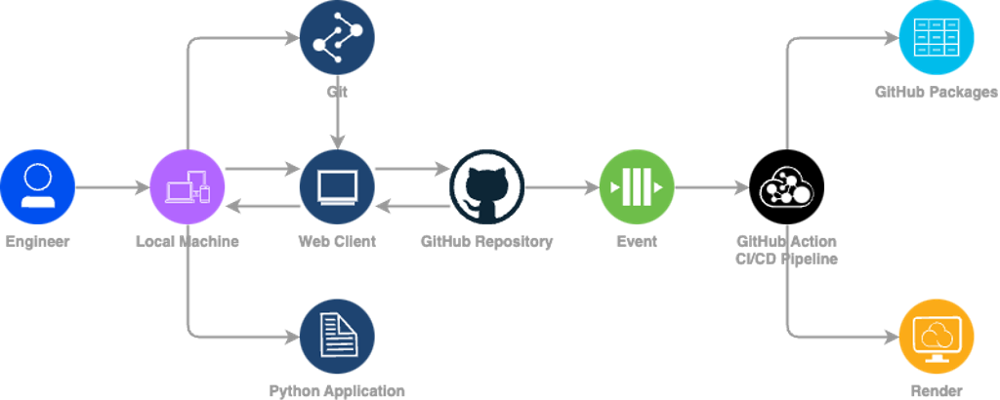
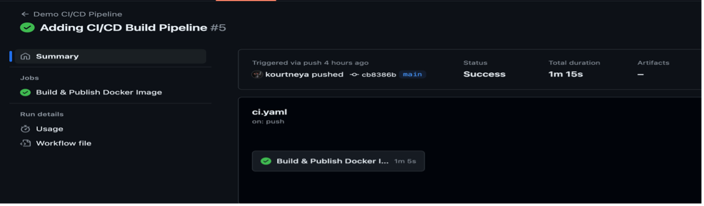
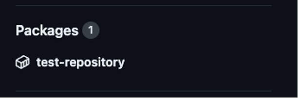
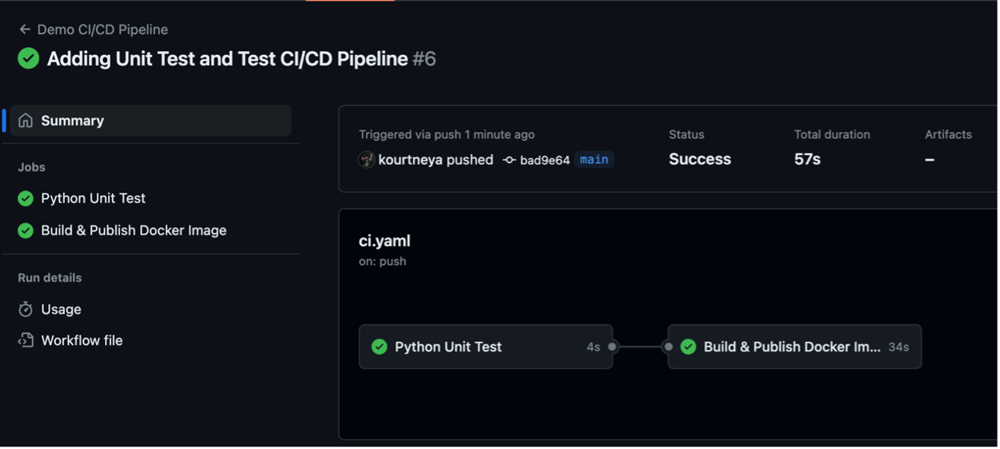
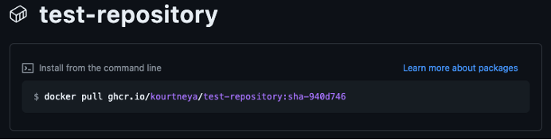
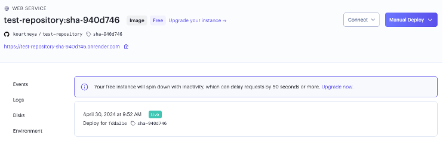

# Let's Automate with GitHub Actions (LABCRT-1151)
### Speakers: Kourtney Barnes

<br>

## Introduction 
This lab session is designed to help you gain hands-on experience and equip you with practical skills while preparing for the DevNet Associate Certification. In the rapid evolving industry of software development, having CI/CD experience is essential for streamlining the delivery of reliable and high-quality applications. CI/CD automation saves time and reduce manual operations when integrating code changes, testing features, and deploying them to production. Most importantly, CI/CD will assist in gaining experience with new concepts and tools such as version control (e.g. Git), build automation (e.g. GitHub Actions), containerization (e.g. Docker), and other cloud native DevOps tools.

<br>

## Learning Objectives
Upon completion of this lab, you will be able to:
- Use and Understand Basic Git Functions
- Initialize a GitHub Repository
- Create a YAML document
- Containerize a Python Applications
- Understand CI/CD fundamentals
- Configure a CI/CD Pipeline with GitHub Actions

<br>

## Scenario
In this lab activity, you will have gained practical skills in setting up a CI/CD pipeline for a Python application. You will create a small application and leverage GitHub Actions, a powerful CI/CD automation tool, to implement a robust CI/CD pipeline that will seamlessly integrate with your GitHub repository. In the CI/CD pipeline you will create an automation to build, test, and deploy your application. You will utilize a version control system in Git to publish your changes to the repository that will kick off the CI/CD automation. You will also have gain experience in containerization by building a docker image to deploy the python application. By the end of this lab, not only will you be able to understand the core principles of CI/CD, you’ll also have gained hands-on experience in software design basics, containerization, and configuring and customizing a DevOps workflow. Nevertheless, you’ll be equipped with valuable skills that are applicable to preparing you for the DevNet Associate Certification.

Throughout the lab feel free to experiment with different configurations to deepen your understanding. The goal is not to just complete the task but to really grasps the concept.

<br>

## Workflow Diagram


<br>

## Let's Automate


### Task 1: Login or Sign Up to GitHub 
1. **Navigate to GitHub:** Go to GitHub website by typing [https://github.com](https://github.com) into your web browser.

2. **Existing GitHub Account Users:** On the homepage, click the `Sign In` button at the top right corner of the page. Then enter user **Username** and **Password** and click the `Sign In` button. ***(Skip to the next task after you have logged in)***

3. **New GitHub Account Users:** On the homepage, you’ll find the `Sign Up` button. Click on the button and it will take you to the signup form.

4. **Fill in form details:** In the `Sign Up` form, provide an email address, and password when prompted.

5. **Verify Email:** If prompt, GitHub may send an email to the email address specified for verification. Login to your email account and follow the instruction for verification.

6. **Congratulations:** You now have a GitHub account.

<br>

### Task 2: Create a New GitHub Repository
1. **Navigate to Your Profile:** Once you are logged in, click on your profile in the top right corner of the webpage. From the dropdown menu click `Your Repositories`.

2. **Create New Repository:** On the repositories page, click the green button that’s labeled `New`.

3. **Fill in Repository Details:** Enter in the required information:
    1. **Repository Name:** Enter a name for the repository (e.g. github-actions-
demo). Name should be unique and contain no spaces.

    2. **Visibility:** Choose either public or private. Public indicates anyone will have visibility to the information within the repository. Private will only be visible to you. Leave the `Public` radio button selected.

    3. **Add README:** Click the `Add a README file` checkbox under `Initialize this repository with:` section

    4. **Add Git Ignore:** When creating folder locations and files, the file system may create hidden directories that are unwanted. The `.gitignore` file will instruct `git` to not add these files to our GitHub Repository. In the drop down select `Python`, since we will be creating a small python application.
4. **Click Create:** Once you have entered in all the required information click `Create Repository`.

5. **Create Personal Access Token:** To push to the repository over HTTPS, you will need a personal access token which you will use as your password when prompt by the CLI in the Terminal.
    1. **Navigate to Your Profile:** Once you are logged in, click on your profile in the top right corner of the webpage. From the dropdown menu, click `Settings`.

    2. **Developer Settings:** On the settings page, click `Developer Settings` in the left toolbar at the very bottom.

    3. **Generate Classic Token:** On the Developer Settings page, click `Personal access token`, then `Tokens (classic)`

    4. **Define Token Scopes:** Click `General New Token (classic)` and select the following scopes.
        - repo
        - workflow
        - admin:org
        - user

    5. **Generate Token:** Once you have selected all scopes click the green `Generate token` button.
6. **Copy Token:** Copy the token generated and save it somewhere. Whenever you have the option to pass in a passkey or token, paste this token as the Token for the security measure. 

7. **Congratulations:** You have now created a GitHub Repository.

<br>

### Task 3: Clone GitHub Repository to local machine
1. **Navigate to Your Repository:** Once you are logged into [GitHub](https://github.com), click on your profile in the top right corner of the webpage. From the dropdown menu, click `Your Repositories`. Then click on the newly created repository (e.g github-actions-demo)

2. **Grab Repository URL:** On the repository's page, click the green button that’s labeled `Code`.

3. **Copy HTTPS URL:** In the dropdown menu, click the `Local` tab, then click `HTTPS`, and copy the URL by highlighting all the text or clicking the two square icon to the right of the text box.

4. **Open Local Terminal:** On your local machine open the Terminal or Command prompt.
    1. **MacOS:** Press the Command & Space buttons on your keyboard, type `Terminal` and press enter.

    2. **Windows:** Click the Start button *(usually Windows icon)* at the bottom left corner of the screen. Type `cmd` and press enter.
5. **Navigate to Desktop Directory:** In the Terminal window type `cd ~/Desktop` (MacOS) or `cd Desktop` (Windows) and press enter.

6. **Clone Repository:** Type `git clone {repository URL copied in step 2}` and press enter. For Example,
    ```bash
    git clone https://github.com/kourtneya/github-actions-demo.git
    ```
    > If you have selected the Private visibility option when creating the repository, you will need to enter your GitHub account credentials.

7. **Navigate inside Repository:** Once the cloning has completed, type `cd {repository name}` and press enter. For Example
    ```bash
    cd github-actions-demo
    ```

8. **View Files:** To view the files in the cloned location, type `ls` (MacOS) or `dir` (Windows). You will the README that you have created during the repository creation. 

9. **Congratulations:** You have now cloned your repository locally.

<br>

### Task 4: Create Python Application
Let’s create a small RESTful API with a health check endpoint

1. **Open Code Editor:** Open any text editor on the local machine. 
    >The lab machines at Cisco Live have Visual Studio Code installed. In the `Terminal`, type `code . ` to open Visual Studio Code to the repository's location. 

2. **Create a New File:** If necessary, click `File` on the top left corner in the tool bar. In the dropdown menu select `New -> File` to create `app.py` file. 

3. **Import Flask:** In the new file import the Flask module by typing in the following:
    ```python
    from flask import Flask, jsonify
    ```

4. **Initialize Flask:** Create a Flask application instance that will start a web server when application starts.
    ```python
    app = Flask(__name__)
    ```

5. **Create Health API Endpoint:** Create a route for the health API endpoint. The endpoint will return a JSON response stating the health status of the application.
    ```python
    @app.route('/health', methods=['GET']) 
    def health_check():
        return jsonify({'status':'OK'})
    ```

6. **Create Flask Executor:** Every python application starts with a `main` method. Let’s add the main method that will run the Flask application when the Python application starts.
    ```python
    if __name__ == '__main__':
         app.run(debug=True)
    ```

7. **Code Overview:** Your file should be similar to the code below.
    ```python
    from flask import Flask, jsonify

    app = Flask(__name__)

    @app.route('/health', methods=['GET']) 
    def health_check():
        return jsonify({'status':'OK'})

    if __name__ == '__main__':
         app.run(debug=True)
    ```

8. **Save File:** Save the file in your cloned repository directory `Desktop/{repository name}` and name it `app.py`.

9. **Install Flask:** In the terminal (Task 3 – Step 3). Using Python’s package manager `pip`, execute the following command:
    ```bash 
    pip install Flask --break-system-packages
    ```

10. **Run Python application:** In your terminal navigate to your repository (if needed), `cd Desktop/{repository name}`, and execute the following command:
    ```bash
    python app.py
    ```

11. **Test Health Endpoint:** Open a new tab in the web browser and type [http://127.0.0.1:5000/health](http://127.0.0.1:5000/health), in the address bar and press ‘Enter’ on the keyboard. You should see a webpage with `{“status”:OK”}`. Press Ctrl + C to stop the application.

12. **Congratulations:** You have created a RESTful API application.

<br>

### Task 5: Push Python Application to GitHub Repository
1. **Navigate to Local Repository:** If you are not already at the repository location in the Terminal, open `Terminal` (Task 3 – Step 3), and use `cd` to navigate to your cloned repository.

2. **Add files to Staging Area:** Add all files to the staging area using the following command:
    ```bash
    git add .
    ```

3. **Commit Changes:** Commit the changes you made and the files you have added in the staging area. All commits require a message.
    ```bash
    git commit -m "python application with Health API endpoint"
    ```
    1. You may be prompt to configure your email, username using `git config`. Run the following to commands
        ```bash
        git config user.name "YOUR NAME"
        git config user.email "YOUR EMAIL"
        ```

4. **Push Commit to GitHub Repository:** The push command will transfer all files committed to the GitHub repository.
    ```bash
    git push origin main
    ```

5. **Confirm Transfer:** Go to GitHub and verify that your code has successfully uploaded.
    1. **Visit GitHub:** GitHub website by typing [https://github.com](https://github.com) into your web browser.

    2. **Navigate to Your Profile:** Once you are logged in, click on your profile in the top right corner of the webpage. Click `Your Repositories` from the dropdown menu.

    3. **Open Repository:** On the webpage click the name of the python repository to view content.

    4. **Verify Updated Changes:** On the home of the repository page, verify there is an `app.py` file 

6. **Congratulations:** Your code has now been uploaded to GitHub using version control.

<br>

### Task 6: Build Docker Image using GitHub Actions
Now that we have created a repository and a small application let’s embark on a journey to create the CI/CD pipeline. Let’s begin with building a Docker image.

1. **Open Code Editor:** Open any text editor on the local machine. 
    >The lab machines at Cisco Live have Visual Studio Code installed. In the `Terminal`, type `code . ` to open Visual Studio Code to the repository's location. 

2. **Create a New File:** If necessary, click `File` on the top left corner in the tool bar. In the dropdown menu select `New -> File` to create `requirements.txt` file. 

3. **List Dependencies:** Add necessary Flask dependency to the file. *(Only one line)*
    ```txt
    flask
    ```

4. **Save File:** Save the file in your local repository directory as `requirements.txt`. This file will be used later.

5. **Create a New File:** If necessary, click `File` on the top left corner in the tool bar. In the dropdown menu select `New -> File` to create `Dockerfile` file.
    > It's important to note IDEs, may added a file extension. But it is very very important to store this file with no file extension

6. **Define base Image:** In a Dockerfile, the first line is always the specification of the base image. Since this is a Python application, the official python image would be appropriate.
    ```txt
    FROM python:3.12
    ```

7. **Set a Working Directory:** Setting a working directory inside of the docker image
where the code will be place is a best practice. In a Dockerfile, the first line is always the specification of the base image. Since this is a Python application, the official python image would be appropriate.
    ```dockerfile
    WORKDIR /app
    ```

8. **Copy Files:** Copy all files within the directory to the working directory of the Docker image.
    ```dockerfile
    COPY . /app
    ```

9. **Install Application Dependencies:** To run the application within docker all
dependencies required to run the application must be installed within the image.
    ```bash
    RUN pip install –-no-cache-dir -r requirements.txt --break-system-packages
    ```

10. **Expose Application Port:** When the python application starts, the web server runs on port 5000. To access the application in the container, port 5000 must be exposed.
    ```dockerfile
    EXPOSE 5000
    ```

11. **Define Run Command:** The following line tells Docker what command to use start
the application when running the docker image.
    ```dockerfile
    CMD ["python", "-m", "flask", "run", "--host=0.0.0.0"]
    ```

12. **Dockerfile Overview:** Here is a complete view of the Dockerfile.
    ```dockerfile
    FROM python:3.12

    WORKDIR /app

    COPY . /app

    pip install –-no-cache-dir -r requirements.txt --break-system-packages
    ```

13. **Save File:** Save the file in your local repository directory as “Dockerfile”. This name is required.

14. Open any text editor on the local machine. 
    >The lab machines at Cisco Live have Visual Studio Code installed. In the `Terminal`, type `code . ` to open Visual Studio Code to the repository's location.

15. **Navigate to Local Repository:** If you are not already at the repository location in the Terminal, open `Terminal` (Task 3 – Step 3), and use `cd` to navigate to your cloned repository.

16. **Create Workspace Directory:** In the terminal within the location of the git repository, use `mkdir` to create a new directory named `.github/workflows`. Don’t forget the period in front of `github`. This directory is what GitHub Actions searches for configuration files.
    ```bash
    mkdir .github
    cd .github
    mkdir workflows
    cd ..
    ```

17. **Define CI/CD Build Pipeline:** In the Code Editor you should see the new folder. Create a new `ci.yaml` file. This YAML file can be named anything but for the references of this lab it will be named `ci.yaml`.
    1. **Name the CI/CD Pipeline:** The first declaration within the YAML file is the name.
        ```yaml
        name: Demo CI/CD Pipeline
        ```

     2. **Define Trigger:** Next, let’s start the pipeline when code has been pushed or
merged to the main branch of the repository.
        ```yaml
        on: 
            push:
                branches:
                    - main
        ```

    3. **Create Global Environment Variable:** Create a global environment variable for the name of the application and container registry so that it can be reused throughout the pipeline stages.
        ```yaml
        env:
            PP_NAME: '${{ github.repository }}' 
            REGISTRY: ghcr.io
        ```
    
    4. **Create Build Task:** Create the build task that will run on `ubuntu-latest`.
        ```yaml 
        jobs: 
            build:
                name: Build & Publish Docker Image 
                runs-on: ubuntu-latest
        ```

    5. **Set Permissions:** Set permissions for the Pipeline to execute steps in this job when using `GITHUB_TOKEN`.
        ```yaml 
        jobs: 
            build:
                name: Build & Publish Docker Image 
                runs-on: ubuntu-latest
                permissions:
                    contents: read
                    packages: write
        ```

    6. **Set Outputs:** To use values created in this step so they can be used in other jobs, it must be exposed. Create an output variable for the `image-tag` that we will set in the build steps.
        ```yaml 
        jobs:
            build:
                name: Build & Publish Docker Image
                ... 
                outputs:
                    image-tag: '${{ steps.meta.outputs.tags }}'
        ```

    7. **Add Code Checkout Build Step:** The first step of the build job is to check out the code within the repository.
        ```yaml 
        jobs:
            build:
                name: Build & Publish Docker Image
                ... 
                steps:
                - name: Checkout Repository
                  uses: actions/checkout@v4
        ```

    8. **Add Container Login Step:** To publish images to the Container Registry (GitHub Packages), login credentials must be provided using the credentials that are automatically created for your account.
        ```yaml 
        jobs:
            build:
                name: Build & Publish Docker Image
                ... 
                steps:
                ...
                - name: Login to Container Registry 
                  uses: docker/login-action@v3 
                  with:
                    registry: '${{ env.REGISTRY }}'
                    username: '${{ github.actor }}'
                    password: '${{ secrets.GITHUB_TOKEN }}'
        ```

    9. **Create Docker Metadata:** Using actions, you can create metadata to use for tagging and labeling the docker image. Extract the metadata to use in future steps.
        ```yaml 
        jobs:
            build:
                name: Build & Publish Docker Image
                ... 
                steps:
                ...
                - name: Extract metadata for Docker 
                  id: meta
                  uses: docker/metadata-action@v4 
                  with:
                    images: '${{ env.REGISTRY }}/${{ env.APP_NAME }}' 
                    tags: |
                        type=sha, format=short
        ```

    10. **Build and Publish Docker Image:** Lastly in the build task, build and publish the docker image with specified tag.
        ```yaml 
        jobs:
            build:
                name: Build & Publish Docker Image
                ... 
                steps:
                ...
                - name: Build and Publish Docker Image 
                  uses: docker/build-push-action@v5 
                  with:
                    context: .
                    push: true
                    tags: '${{ steps.meta.outputs.tags }}' 
                    labels: '${{ steps.meta.outputs.labels }}'
        ```

18. **Complete CI/CD Build Pipeline:** Here is an example of the complete `ci.yaml` file.
    ```yaml 
    name: CLUS GitHub Actions Demo 

    on: 
        push:
            branches:
                - main

    env:
        APP_NAME: '${{ github.repository }}'
        REGISTRY: ghcr.io

    jobs:
        build:
            name: Build & Publish Docker Image
            runs-on: ubuntu-latest
            permissions:
                contents: read
                packages: write
            outputs:
                image-tag: '${{ steps.meta.outputs.tags }}'
            steps:
            - name: Checkout Repository
              uses: actions/checkout@v4
            - name: Login to Container Registry 
              uses: docker/login-action@v3
              with:
                registry: '${{ env.REGISTRY }}'
                username: '${{ github.actor }}'
                password: '${{ secrets.GITHUB_TOKEN}}'
            - name: Extract metadata for Docker
              id: meta
              uses: docker/metadata-action@v4
              with: 
                images: '${{ env.REGISTRY }}/${{ env.APP_NAME }}'
                tags: | 
                    type=sha, format=short
            - name: Build & Publish Docker Image to GitHab Package
              uses: docker/build-push-action@v5
              with: 
                context: . 
                push: true
                tags: '${{ steps.meta.outputs.tags}}'
                labels: '${{ steps.meta.outputs.labels}}'
    ```

19. **Save File:** Save the file in your local repository under the `.github/workflows` directory as `ci.yaml`.

20. **Add files to Staging Area:** Add all files to the staging area using the following command in the terminal:
    ```bash
    git add . 
    ```

21. **Commit Changes:** Commit the changes you made and the files you have added in the staging area. All commits require a message.
    ```bash
    git commit -m "Python application with Health API endpoint"
    ```

22. **Push Commit to GitHub Repository:** The push command will transfer all files committed to the GitHub repository.
    ```bash
    git push origin main
    ```

23. **View GitHub Action Status:** Navigate to the repository in GitHub and click on the `Actions` tab on the GitHub tool bar. Click on the latest workflow to view status. A green check should be visible on `Build & Publish Docker Image` when complete.
    

24. **Verify Docker Image in Packages:** On the main page, the Code tab of the repository, at the right side of the page you should see a container underneath `Packages`.
    

25. **Congratulations:** You have taken your first step to CI/CD and now have an automated build.

<br>

###  Task 7: Add unit test in Python
To create a Test step in our CI/CD pipeline we need to create a Unit Test for our python application.

1. **Open Code Editor:** *(If its not already open)* Open any text editor on the local machine. 
    >The lab machines at Cisco Live have Visual Studio Code installed. In the `Terminal`, type `code . ` to open Visual Studio Code to the repository's location. 

2. **Create a New File:** If necessary, click `File` on the top left corner in the tool bar. In
the dropdown menu select `New -> File` to create `test_app.py` file.

3. **Import Testing Modules:** The first two lines of the new file will be the import of the unit test module for testing and the app module.
    ```python
    import unittest
    from app import app
    ```

4. **Create Test Class Method:** Create a test class that accepts `unittest.TestCase` as a parameter.
    ```python
    class TestHealthEndpointStatusCode(unittest.TestCase):
    ```

5. **Implement Test Scenario:** Indented inside of the `TestHealthEndpoint` method, test if the health endpoint returns the correct HTTP status code and expected response.
    ```python
    class TestHealthEndpoint(unittest.TestCase):
        def test_health_endpoint(self):
            apiTest = app.test_client(self)
            resp = apiTest.get('/health', content_type='application/json')
            self.assertEqual(resp.status_code, 200)
            self.assertEqual(resp.json, {'status':'OK'})
    ```

6. **Complete Code:** Here is the complete code example of testing the API health endpoint.
    ```python
    import unittest
    from app import app

    class TestHealthEndpointStatusCode(unittest.TestCase):
        def test_health_endpoint(self):
            apiTest = app.test_client(self)
            resp = apiTest.get('/health', content_type='application/json')
            self.assertEqual(resp.status_code, 200)
            self.assertEqual(resp.json, {'status':'OK'})
    ```

7. **Save File:** Save the file in your cloned repository directory and name it `test_app.py`.

8. **Verify API test:** In the Terminal at the repository location. Execute the following command to run the unit test locally. 
    >Open Terminal (Task 3 – Step 3), and use `cd` to navigate to your cloned repository. 
    ```bash
    python -m unittest test_app.py
    ```

9. **Congratulations:** You have now created a unit test.

<br>

### Task 8: Create CI/CD Test Pipeline
Now that we have a unit test within our code base, let’s get the CI/CD pipeline to automatically run the test.

1. **Open Code Editor:** *(If its not already open)* Open any text editor on the local machine. 
    >The lab machines at Cisco Live have Visual Studio Code installed. In the `Terminal`, type `code . ` to open Visual Studio Code to the repository's location. 

2. **Navigate to the YAML file:** Open the `ci.yaml` file created in Task 6.

3. **Define Test Job:** Due to python not requiring any compiling, let’s test the code before the build job. Generally, in any CI/CD pipeline the order of execution is build, test, and deploy. Create the Test Task right underneath `jobs`.
    ```yaml
    name: CLUS GitHub Actions Demo 

    ...

    jobs:
        test:
            name: Python Unit Test
            runs-on: ubuntu-latest
        build: 
            ...
    ```

4. **Create Checkout Test Step:** The first step of the test job is to check out the code within the repository.
    ```yaml 
    jobs:
        test:
            name: Python Unit Test
            runs-on: ubuntu-latest
            steps: 
            - name: Checkout Repository
              uses: actions/checkout@v4
    ```

5. **Setup Python:** GitHub actions run each job in a runner environment. This is a virtual environment that needs to be defined on how to execute our task. Create a step to setup python within the virtual environment.
    ```yaml 
    jobs:
        test:
            name: Python Unit Test
            runs-on: ubuntu-latest
            steps: 
            - name: Checkout Repository
              uses: actions/checkout@v4
            - name: Setting up Python
              uses: actions/setup-python@v5
              with: 
                python-version: '3.12'
    ```

6. **Install Dependencies:** Our application uses the Flask framework to standup a webserver for the health API endpoint. Create a step that will install all the dependencies listed in the `requirements.txt` file.
    ```yaml 
    jobs:
        test:
            name: Python Unit Test
            runs-on: ubuntu-latest
            steps: 
            ...
            - name: Install dependencies
              run: |
                pip install -r requirements.txt --break-system-packages
    ```

7. **Execute Unit Test:** Create a step that runs the unit test in the `test_app.py` file.
    ```yaml 
    jobs:
        test:
            name: Python Unit Test
            runs-on: ubuntu-latest
            steps: 
            ...
            - name: Executing Unit Test
              run: |
                python -m unittest discover -v
    ```

8. **Stop Parallelization:** By default, GitHub Actions runs all jobs in parallel. To run jobs in sequential order, update the `build` task to depend on `test` using the `needs` keyword.
    ```yaml
    name: CLUS GitHub Actions Demo 

    ...

    jobs:
        test:
            name: Python Unit Test
            runs-on: ubuntu-latest
            steps:
            ...
        build: 
            name: Build & Publish Docker Image
            runs-on: ubuntu-latest
            needs: test
            permissions:
                ...
    ```

9. **Test Pipeline Full Example:** Here is an example of the update `ci.yaml` file.
    ```yaml 
    name: CLUS GitHub Actions Demo 

    on: 
        push:
            branches:
                - main

    env:
        APP_NAME: '${{ github.repository }}'
        REGISTRY: ghcr.io

    jobs:
        test:
            name: Python Unit Test
            runs-on: ubuntu-latest
            steps: 
            - name: Checkout Repository
              uses: actions/checkout@v4
            - name: Setting up Python
              uses: actions/setup-python@v5
              with: 
                python-version: '3.12'
            - name: Install dependencies
              run: |
                pip install -r requirements.txt --break-system-packages
            - name: Executing Unit Test
              run: |
                python -m unittest discover -v
        build:
            name: Build & Publish Docker Image
            runs-on: ubuntu-latest
            needs: test
            permissions:
                contents: read
                packages: write
            outputs:
                image-tag: '${{ steps.meta.outputs.tags }}'
            steps:
            - name: Checkout Repository
              uses: actions/checkout@v4
            - name: Login to Container Registry 
              uses: docker/login-action@v3
              with:
                registry: '${{ env.REGISTRY }}'
                username: '${{ github.actor }}'
                password: '${{ secrets.GITHUB_TOKEN}}'
            - name: Extract metadata for Docker
              id: meta
              uses: docker/metadata-action@v4
              with: 
                images: '${{ env.REGISTRY }}/${{ env.APP_NAME }}'
                tags: | 
                    type=sha, format=short
            - name: Build & Publish Docker Image to GitHab Package
              uses: docker/build-push-action@v5
              with: 
                context: . 
                push: true
                tags: '${{ steps.meta.outputs.tags}}'
                labels: '${{ steps.meta.outputs.labels}}'
    ```

10. **Save File:** Save the `ci.yaml` file.

11. **Add files to Staging Area:** Add all files to the staging area using the following command in the terminal:
    ```bash
    git add . 
    ```

12. **Commit Changes:** Commit the changes you made and the files you have added in the staging area. All commits require a message.
    ```bash
    git commit -m "Adding Unit Test and Test CI/CD Pipeline"
    ```

13. **Push Commit to GitHub Repository:** The push command will transfer all files committed to the GitHub repository.
    ```bash
    git push origin main
    ``` 

14. **View GitHub Action Status:** Navigate to the repository in GitHub and click on the `Actions` tab on the GitHub tool bar. Click on the latest workflow `Adding Unit Test and Test CI/CD Pipeline` to view status. A green check should be visible on `Python Unit Test` and `Build & Publish Docker Image` when complete.
    

15. **Congratulations:** You have now created a CI Pipeline with build and test tasks.

<br>

### Task 9: Create Render Environment
Before we can perform the CD part of our CI/CD pipeline, we need to have an environment to deploy the docker container. Render is a cloud hosting application that allows developers to quickly deploy applications without the complexities of setting up cloud services and infrastructure.

1. **Navigate to Render Website:** Go to Render website by typing [https://render.com](https://render.com) into your web browser.

2. **Sign In or Sign up:** On the homepage, click the `Sign In` button at the top right corner of the webpage.
    1. **If you already have an account:** Sign In with either the social login options or email and password.

    2. **If you DO NOT have an account:** Click the `Sign Up` link below the `Sign In` button. Create the account either using social login or provide an email and password.
        - **Verify Email:** If requested, Render may send an email to the email address specified for verification. Login to your email account and follow the instructions for verification.

3. **Create API Key:** Once email verification is done and you have successfully logged in, we need to create an API Key so that our CI/CD can integrate with this environment to deploy applications.
    1. **Navigate to Account Settings:** Click on your profile in the top right corner of the webpage. From the dropdown menu select `Account Settings`.

    2. **Create API Key:** On the Settings page, click `API Keys` in the left side bar. Then click `Create API Key` button. Enter a name for the API Key in the pop up and click `Create API Key`.

    3. **Copy API Key:** The API Key will be displayed for you to copy. Copy and store it somewhere we will use this soon. This key will only be displayed once. Once copied, click `Done`.

4. **Create New Web Service:** In Render a Web Service is a type of deployment that will be always running. This is suitable for the python application we have created because of its RESTful API nature. To create a service, click `New +` at the top right corner next to your profile. Then click `Web Service`.
    1. **Existing Image:** On the `Create a Web Service` page, choose the `Deploy an existing image from a registry` option, then click `Next`.

    2. **Docker Image URL:** Open a new tab in your web browser and visit GitHub website. Navigate to your repository. On the right sidebar of the web page, click the container name that is specified under `Packages`.
        

    3. **Copy Image URL:** On the container’s page, copy the image URL specified in the docker command shown. *(e.g. “ghcr.io/kourtneya/test-repository:sha- 940d746”)*
        

    4. **Specify Image URL in Render:** Navigate back to Render browser tab, for the `Image URL` on the `Deploy an image` form, paste the image URL. Then click `Next`.

    5. **Specify Instance Type:** Select the instance type of `Free`, then click the `Create Web Service` button at the bottom of the page.

5. **Copy Service ID:** Once the Web Service has been created, in the URL address copy the service ID and note it somewhere for later use. The service ID begins with `srv-`and ends at the `/`. This service ID will be used in the CI/CD when deploying new images.
   > For Example, `https://dashboard.render.com/web/`srv-coogbeev3ddc738ns11g`/deploys/dep-`
    
6. **Verify Deployment:** When the service is deployed and ready for viewing, a green live label will be presented.
    

7. **Visit Python Health:** Underneath the web service name is the URL to the python application. Click the URL. The first page will be `Not Found`. This is because our python application does not have a route to the root path. To view the health, at the end of the URL type `/health`, then press Enter. You will see the JSON response.
    ```json
    {
        "status": "OK"
    }
    ```

8. **Congratulations:** You have created Render environment with your docker application deployed.

<br>

### Task 10: Create CI/CD Deployment Pipeline
Finally, it the last part of this CI/CD pipeline. Now that we have an application and an environment to deploy the application, let’s create the deployment task within the GitHub Action CI/CD pipeline.

1. **Navigate to GitHub Repository:** Visit GitHub and navigate to the repository.

2. **Add Render API Key as GitHub Secret:** As a best practice, secrets are sacred. They required delicate handling to avoid misuse by attackers. Let’s create a GitHub secret for the Render API Key.
    1. **Access Repository Settings:** Inside of the repository, click on the `Settings` tab located at the top tool bar.

    2. **Access Secrets:** In the `Settings` page, click `Secrets and variables` on the left side menu under Security, then click `Actions` in the dropdown menu.

    3. **Create New Secret:** Click the green `New repository secret` button.

    4. **Add Secret:** Give the Render API Token a unique name that will be used in the CI/CD pipeline. Paste the API Key copied from Render, then click the green `Add secret` button.

3. **Open CI/CD YAML file:** Open the `ci.yaml` file located in your local repository at the `.github/workflows` path in any code or text editor.

4. **Define Deploy Task:** Create the deploy job that will run on ubuntu virtual environment and wait to execute until after the build task has completed.
    ```yaml 
    name: CLUS GitHub Actions Demo 

    ...

    jobs:
        test:
            name: Python Unit Test
            runs-on: ubuntu-latest
            ...
        build:
            name: Build & Publish Docker Image
            runs-on: ubuntu-latest
            needs: test
            permissions:
                contents: read
                packages: write
           ...
        deploy:
            name: Deploy Python application
            runs-on: ubuntu-latest
            needs: build
    ```

5. **Create Deploy Step:** Create a single step that deploys the docker image created in the `build` task to Render.
    ```yaml 
    name: CLUS GitHub Actions Demo 

    ...

    jobs:
        ...
        deploy:
            name: Deploy Python application
            runs-on: ubuntu-latest
            needs: build
            steps: 
            - name: Deploy to Render
              uses: fjogeleit/http-request-action@v1
              with: 
                url: https://api.render.com/v1/services/<service-id>/deploys
                method: POST
                bearerToken: '${{ secrets.RENDER_TOKEN }}'
                data: '{"imageUrl":"${{ needs.build.outputs.image-tag }}"}'
    ```

    1. Let’s unpack what going on here. This step is using a HTTP request ‘action’ to invoke Render’s RESTful API.

    2. The‘action’ needs the following configuration to invoke the API:
        - **url:** The url and endpoint to execute for deploying a new docker image to the Web Service created in Render. 
            >**NOTE:** update the `<service-id>` with the service ID copied in previous task when deploying the Web Service. (Task 9 – Step 8)

        - **method:** The HTTP POST method is used to send data in a json request to the endpoint.

        - **bearerToken:** The bearer token is the authentication mechanism to authorize a request to the URL endpoint. The token used here is the API Key created under the profile in Render. As this is a sacred value, the secret created in the previous step is used to encapsulate the value and stop it from being exposed in logs.

        - **data:** The data attribute is where the JSON payload is inserted. Inside the JSON payload is an attribute labeled `imageUrl`. This attribute is required to send the docker image created in the `build` job.

6. **Deploy Pipeline Full Example:** Here is the updated `ci.yaml` layout
    ```yaml 
    name: CLUS GitHub Actions Demo 

    on: 
        push:
            branches:
                - main

    env:
        APP_NAME: '${{ github.repository }}'
        REGISTRY: ghcr.io

    jobs:
        test:
            name: Python Unit Test
            runs-on: ubuntu-latest
            steps: 
            - name: Checkout Repository
              uses: actions/checkout@v4
            - name: Setting up Python
              uses: actions/setup-python@v5
              with: 
                python-version: '3.12'
            - name: Install dependencies
              run: |
                pip install -r requirements.txt --break-system-packages
            - name: Executing Unit Test
              run: |
                python -m unittest discover -v
        build:
            name: Build & Publish Docker Image
            runs-on: ubuntu-latest
            needs: test
            permissions:
                contents: read
                packages: write
            outputs:
                image-tag: '${{ steps.meta.outputs.tags }}'
            steps:
            - name: Checkout Repository
              uses: actions/checkout@v4
            - name: Login to Container Registry 
              uses: docker/login-action@v3
              with:
                registry: '${{ env.REGISTRY }}'
                username: '${{ github.actor }}'
                password: '${{ secrets.GITHUB_TOKEN}}'
            - name: Extract metadata for Docker
              id: meta
              uses: docker/metadata-action@v4
              with: 
                images: '${{ env.REGISTRY }}/${{ env.APP_NAME }}'
                tags: | 
                    type=sha, format=short
            - name: Build & Publish Docker Image to GitHab Package
              uses: docker/build-push-action@v5
              with: 
                context: . 
                push: true
                tags: '${{ steps.meta.outputs.tags}}'
                labels: '${{ steps.meta.outputs.labels}}'
        deploy:
            name: Deploy Python application
            runs-on: ubuntu-latest
            needs: build
            steps: 
            - name: Deploy to Render
              uses: fjogeleit/http-request-action@v1
              with: 
                url: https://api.render.com/v1/services/<service-id>/deploys
                method: POST
                bearerToken: '${{ secrets.RENDER_TOKEN }}'
                data: '{"imageUrl":"${{ needs.build.outputs.image-tag }}"}'
    ```

7. **Save File:** Save the `ci.yaml` file.

8. **Update Health Response:** Since we deployed our application manually for the initial setup and witness the expected JSON response when accessing the application via web browser, update the JSON response in the app.py file to `UP`.
    ```python
    @app.route('/health', methods=['GET'])
    def health_check():
        return jsonify({'status':'UP'})
    ```

9. **Update Health Test:** Because we have updated the JSON response in the `app.py`, we must update the `TestHealthEndpoint` in `test_app.py`. Otherwise, the test will fail.
    ```python
    class TestHealthEndpoint(unittest.TestCase):
        def test_health_endpoint(self):
            apiTest = app.test_client(self)
            resp = apiTest.get('/health', content_type='application/json')
            self.assertEqual(resp.status_code, 200)
            self.assertEqual(resp.json, {'status':'UP'})
    ```

10. **Save Files:** Save both `app.py` and `test_app.py`

11. **Add files to Staging Area:** Add all files to the staging area using the following
command in terminal:
    ```bash
    git add .
    ```

12. **Commit Changes:** Commit the changes you made and the files you have added in the staging area. All commits require a message.
    ```bash
    git commit -m "Updating CI/CD to include Deployment"
    ```

13. **Push Commit to GitHub Repository:** The push command will transfer all files committed to the GitHub repository.
    ```bash
    git push origin main
    ```

14. **View GitHub Action Status:** Navigate to the repository in GitHub and click on the Actions tab on the GitHub toolbar. Click on the latest workflow `Updating CI/CD to include Deployment` to view status. A green check should be visible on all jobs.
    

15. **Access Python Application:** Now that we have updated the application, lets confirm the changes.
    1. **Navigate to Render:** Open web browser and navigate to [https://render.com](https://render.com)

    2. **Login:** Login to Render with your credentials.

    3. **Access Web Service:** On the Dashboard page, click the service that’s deployed under the `Service Name`

    4. **Live Update**: The Deployment may take some time to update. Please wait until the deployment has finished. You will see a green `Live` label on the web service
        

    5. **Navigate to Python Application:** On the Web Service page, click the URL listed under the Web Service name. On first launch, a `Not Found` page will appear. To access the health endpoint, append `/health` to URL and press `Enter`.
        ```json
        {
            "status": "UP"
        }
        ```

16. **Congratulations:** You have now created an application using Python and a full CI/CD pipeline using GitHub Actions. You can view the entire project at [https://github.com/kourtneya/clus-ghaction-lab](https://github.com/kourtneya/clus-ghaction-lab)

<br>

---

## In Summary
You embarked on a journey that created a small Python application which leverage GitHub Actions to implement a CI/CD pipeline. In this lab you explored essential software design basics like building an application using the Python programming language, versioning the codebase using Git, and creating a data format using YAML. You also gained hands-on experience with API Programmability using libraries and invoking RESTful APIs over HTTP. Most importantly **YOU BUILT A CI/CD PIPELINE!!**.

Thanks for spending time with this lab but your learning isn’t over. Now that you have created a CI/CD pipeline, try enhancing it with a job for code coverage, vulnerability scans, and/or tagging a release. The power is in your hands!