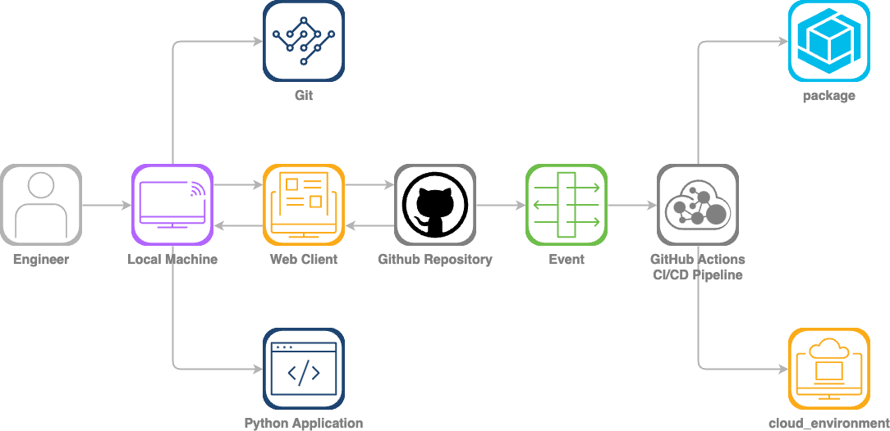

# Overview

## Introduction

This lab session is designed to help you gain hands-on experience and equip you with practical skills while preparing for the DevNet Associate Certification. In the rapid evolving industry of software development, having CI/CD experience is essential for streamlining the delivery of reliable and high-quality applications. CI/CD automation saves time and reduce manual operations when integrating code changes, testing features, and deploying them to production. Most importantly, CI/CD will assist in gaining experience with new concepts and tools such as version control (e.g. Git), build automation (e.g. GitHub Actions), containerization (e.g. Docker), and other cloud native DevOps tools.

## Learning Objectives
Upon completion of this lab, you will be able to:

- Use and Understand Basic Git Functions
- Initialize a GitHub Repository
- Create a YAML document
- Containerize a Python Applications
- Understand CI/CD fundamentals
- Configure a CI/CD Pipeline with GitHub Actions

## Scenario
In this lab activity, you will have gained practical skills in setting up a CI/CD pipeline for a Python application. You will create a small application and leverage GitHub Actions, a powerful CI/CD automation tool, to implement a robust CI/CD pipeline that will seamlessly integrate with your GitHub repository. In the CI/CD pipeline you will create an automation to build, test, and deploy your application. You will utilize a version control system in Git to publish your changes to the repository that will kick off the CI/CD automation. You will also have gain experience in containerization by building a docker image to deploy the python application. 

By the end of this lab, not only will you be able to understand the core principles of CI/CD, you’ll also have gained hands-on experience in software design basics, containerization, and configuring and customizing a DevOps workflow. Nevertheless, you’ll be equipped with valuable skills that are applicable to preparing you for the DevNet Associate Certification.

Throughout the lab feel free to experiment with different configurations to deepen your understanding. The goal is not to just complete the task but to really grasps the concept.

## Workflow Diagram

<figure markdown>
  { width="880" }
</figure>

## Lab Requirements 
- Visual Studio Code (Text Editor)
- Git (Version Control System)
- Docker 

## Disclaimer

This lab is not intended to be a practice exam for the DevNet Associate exam. It's intended to help with gaining hands on experience with a few of the software development skills and give exposure to the concept of CI/CD which are objectives for the exam.

## Let's Automate!!

 