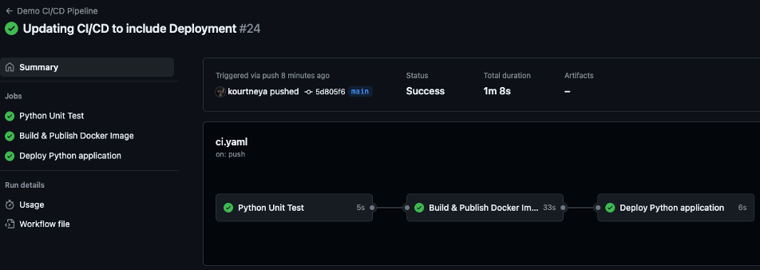

# Task 10 - GitHub Actions Deployment Pipeline
Finally, you are at the last part of this CI/CD pipeline. CD in CI/CD is interchangeable between Continuous Delivery or Continuous Deployment. Depending on how far you take the last step determines which term is used. In continuous delivery, code changes go through the automated steps of build, test, and stops pre-production tasks like packaging the artifact. There is still a manual task to release the artifact to production environments giving full control to an individual or team. In continuous deployment, code changes go through the entire automated steps including deploying the artifact to the production environment. Usually, in continuous deployments there are more strenuous testing to ensure no vulnerabilities or bugs that introduce breaking changes are pushed to through the production environment. In this lab, you will be building a GitHub Action job for continuous deployment as the docker image that is built will be sent to the Render environment for deployment.

## Step 1: Update the Python Application
Since you deployed the python application that returns **`OK`** in the response. Let's update the `/health` endpoint to return the status of **`UP`** so that when the pipeline runs the job to deploy you can see the changes in the web browser. 

1. In Visual Code, click on the `app.py` file

2. In the `health_check` method, update the return status to `UP`
    ```{.python hl_lines="3"}
    @app.route('/health', methods=['GET'])
    def health_check():
        return jsonify({'status':'UP'})
    ```

3. Save the file by clicking save in the File toolbar option, or by using keyboard shortcuts 

    - MacOS

        <kbd>Command</kbd> + <kbd>S</kbd> 

    - Windows

        <kbd>Ctrl</kbd> + <kbd>S</kbd>

## Step 2: Update the Python Unit Test
Because you have updated the JSON response for the health check method in the `app.py` file, you must update the `TestHealthEndpoint` unit test in `test_app.py`. Otherwise, the test will fail.

1. Update the assertion for the response in the `test_health_endpoint` method

    ```{.python hl_lines="6"}
    class TestHealthEndpoint(unittest.TestCase):
        def test_health_endpoint(self):
            apiTest = app.test_client(self)
            resp = apiTest.get('/health', content_type='application/json')
            self.assertEqual(resp.status_code, 200)
            self.assertEqual(resp.json, {'status':'UP'})
    ```

2. Save the file by clicking save in the File toolbar option, or by using keyboard shortcuts 

    - MacOS

        <kbd>Command</kbd> + <kbd>S</kbd> 

    - Windows

        <kbd>Ctrl</kbd> + <kbd>S</kbd>

## Step 3: Add Render API Key as GitHub Secret
Remember the API Key you copied from Render, well, now its time to add it in GitHub as a secret in the repository. Adding it as a secret will not expose the credential when GitHub Actions use it in a secure manner during the automated workflow to deploy the application in Render.

1. Navigate to your GitHub Repository and click the `Settings` tab located on the toolbar inside the repository page

2. In the `Settings` page, click `Secrets and variables` on the left side menu under Security, then click `Actions` in the dropdown menu.

3. Click the green `New repository secret` button.

4. Give the unique name of `RENDER_TOKEN` which will be used in the CI/CD pipeline and paste the API Key copied from Render, then click the green `Add secret` button

## Step 4: Define Deployment Job
Now that the API Key has been configured within the GitHub repository, let's create the deployment job to deploy the docker image to Render after every code change.

1. Create the deploy job that will run on ubuntu virtual environment and wait to execute until after the build task has completed.

    ```{.yaml hl_lines="18 19 20 21"} 
    name: CLUS GitHub Actions Demo 

    ...

    jobs:
        test:
            name: Python Unit Test
            runs-on: ubuntu-latest
            ...
        build:
            name: Build & Publish Docker Image
            runs-on: ubuntu-latest
            needs: test
            permissions:
                contents: read
                packages: write
           ...
        deploy:
            name: Deploy Python application
            runs-on: ubuntu-latest
            needs: build
    ```

2. Create a single step that deploys the docker image created in the `build` task to Render. Replace the `<service-id>` placeholder with the Render Web Service ID you copied in [Task 9 - Step 4](task_9.md/#step-4-copy-the-service-id)

    ```{.yaml hl_lines="11 12 13 14 15 16 17 18"}  
    name: CLUS GitHub Actions Demo 

    ...

    jobs:
        ...
        deploy:
            name: Deploy Python application
            runs-on: ubuntu-latest
            needs: build
            steps: 
            - name: Deploy to Render
              uses: fjogeleit/http-request-action@v1
              with: 
                url: https://api.render.com/v1/services/<service-id>/deploys
                method: POST
                bearerToken: '${{ secrets.RENDER_TOKEN }}'
                data: '{"imageUrl":"${{ needs.build.outputs.image-tag }}"}'
    ```

    - **`uses: fjogeleit/http-request-action@v1`**: A GitHub action that executes HTTP request 
    - **`url: https://api.render.com/v1/services/<service-id>/deploys`**: The API Url of the Render application to send the docker image
    - **`method`**: The HTTP POST method is used to send data in a json request to the endpoint
    - **`bearerToken`**: The bearer token is the authentication mechanism to authorize a request to the URL endpoint. The token used here is the Render API Key you stored as a secret in the GitHub repository settings
    - **`data`**: The data attribute is where the JSON payload is inserted. Inside the JSON payload is an attribute labeled `imageUrl`. This attribute is required to send the docker image created in the `build` job

## Step 5: Full Workflow file
```yaml 
name: CLUS GitHub Actions Demo  

on: 
    push:
        branches:
            - main

env:
    APP_NAME: '${{ github.repository }}'
    REGISTRY: ghcr.io

jobs:
    test:
        name: Python Unit Test
        runs-on: ubuntu-latest
        steps: 
        - name: Checkout Repository
          uses: actions/checkout@v4
        - name: Setting up Python
          uses: actions/setup-python@v5
          with: 
            python-version: '3.12'
        - name: Install dependencies
          run: |
            pip install -r requirements.txt --break-system-packages
        - name: Executing Unit Test
          run: |
            python -m unittest discover -v
    build:
        name: Build & Publish Docker Image
        runs-on: ubuntu-latest
        needs: test
        permissions:
            contents: read
            packages: write
        outputs:
            image-tag: '${{ steps.meta.outputs.tags }}'
        steps:
        - name: Checkout Repository
          uses: actions/checkout@v4
        - name: Login to Container Registry 
          uses: docker/login-action@v3
          with:
            registry: '${{ env.REGISTRY }}'
            username: '${{ github.actor }}'
            password: '${{ secrets.GITHUB_TOKEN}}'
        - name: Extract metadata for Docker
          id: meta
          uses: docker/metadata-action@v4
          with: 
            images: '${{ env.REGISTRY }}/${{ env.APP_NAME }}'
            tags: | 
                type=sha, format=short
        - name: Build & Publish Docker Image to GitHab Package
          uses: docker/build-push-action@v5
          with: 
            context: . 
            push: true
            tags: '${{ steps.meta.outputs.tags}}'
            labels: '${{ steps.meta.outputs.labels}}'
    deploy:
        name: Deploy Python application
        runs-on: ubuntu-latest
        needs: build
        steps: 
        - name: Deploy to Render
          uses: fjogeleit/http-request-action@v1
          with: 
            url: https://api.render.com/v1/services/<service-id>/deploys
            method: POST
            bearerToken: '${{ secrets.RENDER_TOKEN }}'
            data: '{"imageUrl":"${{ needs.build.outputs.image-tag }}"}'
```

## Step 6: Save the Workflow File
Save the file by clicking save in the File toolbar option, or by using keyboard shortcuts 

- MacOS

    <kbd>Command</kbd> + <kbd>S</kbd> 

- Windows

     <kbd>Ctrl</kbd> + <kbd>S</kbd>

## Step 7: Add Files to Staging Area
Back in the terminal, add the new file(s) to the git staging area to be prepared to send to the GitHub repository. Execute the following command to add all files to the staging area 

```bash
git add . 
```

## Step 8: Commit Changes 
Once all files have been added to the staging area, its now time to commit that changes in the staging area. The `git commit -m "message"` command will create a snapshot of the files the files in the staging area. The snapshot will be identified with a unique identifier called a **commit hash**. This hash will be used when tagging the docker image in the build step. To commit the files in the staging are execute the following command

```bash
git commit -m "Updating CI/CD to include Deployment"
```

## Step 9: Push Commit to GitHib Repository
Execute the command below to upload your local changes to GitHub

```bash
git push origin main
```

## Step 10: View GitHub Action Status
Navigate to the repository in GitHub and click on the `Actions` tab on the GitHub tool bar. Click on the latest workflow to view status. Notice how the `Deploy Python application` doesn't start until the `Build & Publish Docker Image` job finishes. A green check should be visible on `Python Unit Test`, `Build & Publish Docker Image`, and `Deploy Python application` when all are complete.
    <figure markdown>
      { width="880" }
    </figure>

<br>

**Congratulations:** You have now created an application using Python and a full CI/CD pipeline using GitHub Actions. You can view the entire project at [https://github.com/kourtneya/clus-ghaction-lab](https://github.com/kourtneya/clus-ghaction-lab)

<br>