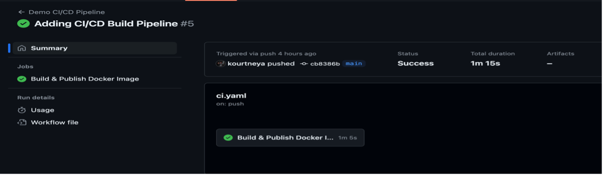
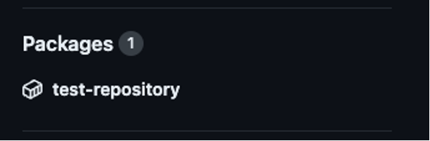

# Task 6 - GitHub Actions Build Pipeline
The CI/CD fun begins! Continuous Integration and Continuous Delivery (CI/CD) is a key pilar of automation. The CI/CD automation is designed in a series of processes called pipelines that enables development teams to follow a standardize process that improves the speed, quality, and reliability of software delivery. While pipelines are designed in many many fashions, the most fundamental structure of a CI/CD pipeline is the build, test, and deployment stages. The first up is the build stage. The build stage is usually the first part of the pipeline because it's where the source code is compiled or packaged into its executable state. In this lab, you will containerize your python application by building and packaging a docker image. 

Docker is a platform that allows you to package your application along with its dependencies like Flask into a container. To create a docker container you must build a docker image which is a lightweight and standalone executable that is portable which includes everything needed like the codebase, libraries, environment variables, and runtime to run the application. A docker image simplifies the deployment process as the same image can be used to instantiate a container in each environment. 

## Step 1: Create New Requirements File
As mentioned, when creating a docker image we need to specify all the dependencies need to run the application within the docker container. Let's create a `requirments.txt` that will include our Flask dependency needed to run the python web service. 

1. Back in the code editor (Visual Studio Code), at the top left corner in the tool bar, click `File`

2. In the drop down menu select `New -> File`

3. Name the file `requirements.txt`

4. In the `requirements.txt` add `flask`
```txt
flask
```

5. Save the file by clicking save in the File toolbar option, or by pressing <kbd>Command</kbd> + <kbd>S</kbd> (Mac OS) or <kbd>Ctrl</kbd> + <kbd>S</kbd> (Windows)

## Step 2: Create New Dockerfile 
The `Dockerfile` is a script containing instructions on how to build your docker image. It defines everything the image needs to run successfully instantiate a docker container. 

1. At the top left corner in the tool bar, click `File`

2. In the drop down menu select `New -> File`

3. Name the file `Dockerfile`
!!! note
    It's important to note IDEs, may add a file extension to the end of the name. It is very very important to store this file with no file extension

## Step 3: Define the Base Image
In the `Dockerfile`, the first line is always the specification of the base image. Since this is a Python application, the official python image would be appropriate to use as the base image. 
```dockerfile
FROM python:3.12
```

## Step 4: Set a Working Directory
Inside the docker container we need to set a location where we can copy the code or package to execute the application. Also, all subsequent instructions in the Dockerfile will be executed from this path location. 
```dockerfile
WORKDIR /app
```

## Step 5: Copy Files
Next you need to copy all the files from the relative location of the Dockerfile to the working directory of the image.
```dockerfile
COPY . /app
```

## Step 6: Install Application Dependencies
Depending on the base image you use, the image may or may not have the libraries or tools needed to successfully run the application. The `RUN` command executes commands in the image to install dependencies and/or tools or simply just build the app. Just as you have done in the local file system, you have to install the dependencies in the image. 
```dockerfile 
RUN pip install -r requirements.txt --break-system-packages
```

## Step 7: Expose Application Port
When the container starts you will set up a port to access the application. The `EXPOSE` command will tell Docker that the container will listen on this specified network port. In python using Flask, the default port is 5000. This can be configured to a different port using the flask library but for this lab the default port will be just fine. 
```dockerfile
EXPOSE 5000
```

## Step 8: Specify the Execute Command
Running a docker container is one thing but you need to instruct docker how to run the application. There are two ways to start the application in Docker, the `CMD` and `ENTRYPOINT` commands. The `CMD` command is used for providing default arguments or command but it can be overridden. If the `ENTRYPOINT` command is used the values set for it will always execute when the container starts. For the `ENTRYPOINT` command the value cannot be overridden like the `CMD` command instead arguments will be appended to the value. In this lab, you will be using the `CMD` command. 
```dockerfile
CMD ["python", "-m", "flask", "run", "--host=0.0.0.0"]
```

## Step 9: Dockerfile Overview 
Here is the complete view of the Dockerfile 
```dockerfile 
FROM python:3.12

WORKDIR /app

COPY . /app

RUN pip install –-no-cache-dir -r requirements.txt --break-system-packages

EXPOSE 5000

CMD ["python", "-m", "flask", "run", "--host=0.0.0.0"]
```

## Step 10: Save Dockerfile 
Save the file by clicking save in the File toolbar option, or by pressing 

- MacOS
<kbd>Command</kbd> + <kbd>S</kbd>

- Windows
<kbd>Ctrl</kbd> + <kbd>S</kbd>

## Step 11: Add Github Workspace Folder
1. Navigate to local repository in the terminal
    - In your terminal, ensure you that your working directory is at your local repository path. 

        - MacOS <br>
        ```bash 
        pwd
        ```
        ```{.bash .no-copy}
        /Users/(username)/Desktop/github-actions-demo
        ```

        - Windows <br>
        ```bash
        pwd
        ```
        ```{.bash .no-copy}
        \Users\(username)\Desktop\github-actions-demo
        ```

    - If working directory is not at your local repository path use the `cd` command to get to the desire path. 

        - MacOS <br>
        ```bash 
        cd ~/Desktop/github-actions-demo
        ```

        - Windows <br>
        ```bash
        cd $HOME\Desktop\github-actions-demo
        ```

2. In the terminal, you need to create a new folder named `.github`. Inside that folder there also needs to be a folder named `workflows`. The `.github/workflows` folder let's GitHub Actions pick up all the automated workflows you have defined. 

    ```bash
    mkdir -p .github/workflows
    ```

3. In Visual Code, you should see the folders listed in the left toolbar. 
    <figure markdown>
      { width="500" }
    </figure>

## Step 12: Created Workflow File
Now that you have the folder location that GitHub Actions require to run automation, let's create the workflow file. GitHub Actions requires the workflow file to be written using the YAML syntax.

1. In Visual Code, click on the new `.github/workflows` folder, then proceed to top left corner in the tool bar, click `File`

2. In the drop down menu select `New -> File`

3. Name the file `ci.yaml`

## Step 13: Define CI/CD Build Pipeline
Defining the build pipeline consist of a few parts; Job, Step, Action. 

- **Job:** Is a collection of steps that are executed. They can run sequentially or in parallel. 

- **Step:** An individual task within a job. They can execute commands, scripts, or `actions`.

- **Action:** Reusable pieces of code that help automate common tasks (e.g checking out code, installing dependencies, building artifacts)

1. The first declaration within the YAML file is the `name`. The name identifies the workflow and appears in the GitHub Actions interface for easy identification
    ```yaml
    name: CLUS GitHub Actions Demo 
    ```

2. Next in the YAML file is setting when you would like the workflow to start. The `on` property specifies when (e.g push, pull request) the pipeline will start. Not only can you define the when, you can define the conditions the pipeline should start as well. In this lab, you will start the workflow when the code has been pushed or merged to the main branch of the repository
    ```yaml
    on: 
        push:
            branches:
                - main
    ```

3. Much like other applications you can set environment variables to be used throughout the execution so that the value can be set once and used multiple times. Create environment variables for the name of the application and container registry so that it can be used throughout the various stages
    ```yaml
    env:
        APP_NAME: '${{ github.repository }}' 
        REGISTRY: ghcr.io
    ```

    The container registry is where the docker image will be stored for later use. It's a repository for containerized images. 
        
4. Create the `jobs` section that will list all the jobs your automation will handle. Within this section, you will define the build pipeline. 
    ```yaml
    jobs:
        build:
            name: Build & Publish Docker Image
            runs-on: ubuntu-latest
    ```

    - **`jobs`**: The root level containing all jobs
    - **`build`**: The name of the job, think of this as more of an ID. This name can be used throughout the workflow file to reference outputs the job may have. This can be named anything but for this lab it will be referenced as build. 
        - **`name`**: The name of the Build. This name will be shown in GitHub Actions UI which you will see later in the demo
        - **`runs-on`**: This specifies the type of virtual machine or container with all the necessary tools and software to execute the tasks define in the steps provided 

5. In order to read and write content within the repository and to publish artifacts to the GitHub container registry, you will need to allow GitHub Actions permission to do so. Give the `build` job permissions to read content and publish artifacts.
    ```{.yaml hl_lines="5 6 7"} 
    jobs: 
        build:
            name: Build & Publish Docker Image 
            runs-on: ubuntu-latest
            permissions:
                contents: read
                packages: write
    ```

6. Because the build will produce a Docker image, it's best practice when building docker images to tag them so they can be referenced as a way of versioning. This way end users can pull specific versions of the application due to various use cases like new version includes breaking changes, integrated systems not ready for new features, etc. Create an output variable for the image tag within the build job so that other jobs created later in the pipeline can reference the current build. 
    ```{.yaml hl_lines="5 6"} 
    jobs: 
        build:
            name: Build & Publish Docker Image 
            ...
            outputs:
                image-tag: '${{ steps.meta.outputs.tags }}'
    ```

    The value of `image-tag` will be set from a step that will execute a GitHub Action which is a piece of code that performs some task. You can access the value of an output of step by following the `${{ steps.<step_id>.outputs.<output_name> }}` syntax. 

7. The first step of the build pipeline is to checkout out the code within the repository. You might wonder "If I'm within the repository and the code is within the repository, why do I need to checkout the code". Well as mentioned in two steps above you defined a `runs-on` attribute. Each job is running in a containerized application thus the codebase is not there, only the base image you provided. The `steps` you are going to start defining will be adding all the files, dependencies, and other tools required to perform one or more tasks. Define the `steps` section and create a step to checkout the repository.
    ```{.yaml hl_lines="5 6 7"} 
    jobs:
        build:
            name: Build & Publish Docker Image
            ... 
            steps:
            - name: Checkout Repository
              uses: actions/checkout@v4
    ```

    - **`steps`**: The root level for defining a list of steps
        - **`-`**: Begins the the list of steps. Each step will need to begin with this character
        - **`name`**: The name is an optional descriptor for the step that will help you understand what each step is doing in the workflow
        - **`uses`**: To execute an action each step will include either a `run` or a `uses` key. The `uses` key indicates that you are using an existing GitHub Action. A GitHub Action is a piece of code that can be reused in various workflows. It is the "thing" that performs the tasks. You can create your own "action" or use an "action" created by others that are typically available on the GitHub Marketplace. 

8. The next step is to login to the container registry. To publish docker images to the container registry, in this case GitHub Packages, you must provide the login credentials. Use an existing GitHub Action to login to the container registry. 
    ```{.yaml hl_lines="7 8 9 10 11 12"} 
    jobs:
        build:
            name: Build & Publish Docker Image
            ... 
            steps:
            ...
            - name: Login to Container Registry 
              uses: docker/login-action@v3 
              with:
                registry: '${{ env.REGISTRY }}'
                username: '${{ github.actor }}'
                password: '${{ secrets.GITHUB_TOKEN }}'
    ```

    - **`uses`**: Specifies an existing GitHub Action to execute
        - **`with`**: This key is used to provide inputs to an action
        - **`registry`**: The url of the docker registry to publish the image for later use. The `'${{ env.REGISTRY }}'` is the value that was specified in the environment variable at the top of the workflow file.
        - **`username`**: Then user name credential to login to the registry. The `'${{ github.actor }}'` is a built-in variable that represents the username of the person or app that triggered the workflow. 
        - **`password`**: The password to login to the registry. The `'${{ secrets.GITHUB_TOKEN }}'` is a encrypted value stored in GitHub of an access token with permissions to read and write data to the registry. You will create this secret later in the lab. 

9. After checking out the code and logging into the container registry, create a step to tag the docker image. This step will use another GitHub Action that will use the repository's metadata to tag the image. Also, in this step you will create the `id` that was used in the outputs to expose the tag value so that it can be used in another job later in the lab. Visit [Docker Metadata Action](https://github.com/docker/metadata-action?tab=readme-ov-file#outputs) for a list of properties that can be retrieved as outputs for the `docker/metadata-action@v4` action.
    ```{.yaml hl_lines="7 8 9 10 11 12 13"} 
    jobs:
        build:
            name: Build & Publish Docker Image
            ... 
            steps:
            ...
            - name: Extract metadata for Docker 
              id: meta
              uses: docker/metadata-action@v4 
              with:
                images: '${{ env.REGISTRY }}/${{ env.APP_NAME }}' 
                tags: |
                    type=sha, format=short
    ```

    - **`id`**: An optional key that acts as a label or a reference so that other steps in the workflow can refer back to it. Commonly used to access that steps outputs
    - **`images`**: The image name input that is passed to the action. `'${{ env.REGISTRY }}/${{ env.APP_NAME }}'` is the values specified as an environment variable at the top of the workflow file
    - **`tags`**: Another input to the GitHub action to configure how the tag should be created. This configuration specifies that the tag should be the short version of hash from latest GitHub commit. 
    - **` | `**: Specifies a multiline input

10. Last step in the build job is actually building and publishing the docker image to the container registry (i.e GitHub Packages). The `docker/build-push-action@v5` GitHub Action will execute the necessary docker commands to build and publish the docker image with the specified tags. 
    ```{.yaml hl_lines="7 8 9 10 11 12 13"} 
    jobs:
        build:
            name: Build & Publish Docker Image
            ... 
            steps:
            ...
            - name: Build and Publish Docker Image 
              uses: docker/build-push-action@v5 
              with:
                context: .
                push: true
                tags: '${{ steps.meta.outputs.tags }}' 
                labels: '${{ steps.meta.outputs.labels }}'
    ```

    - **`context`**: Input parameter that instructs the action to read the Dockerfile from the specified location
    - **`push`**: Property that tells the action to push the image to the container registry
    - **`tags`**: A list of tag names to build and create the docker image with
    - **`labels`**: Labeling the docker image

11. The complete workflow file for the build step
    ```yaml 
    name: CLUS GitHub Actions Demo  

    on: 
        push:
            branches:
                - main

    env:
        APP_NAME: '${{ github.repository }}'
        REGISTRY: ghcr.io

    jobs:
        build:
            name: Build & Publish Docker Image
            runs-on: ubuntu-latest
            permissions:
                contents: read
                packages: write
            outputs:
                image-tag: '${{ steps.meta.outputs.tags }}'
            steps:
            - name: Checkout Repository
              uses: actions/checkout@v4
            - name: Login to Container Registry 
              uses: docker/login-action@v3
              with:
                registry: '${{ env.REGISTRY }}'
                username: '${{ github.actor }}'
                password: '${{ secrets.GITHUB_TOKEN}}'
            - name: Extract metadata for Docker
              id: meta
              uses: docker/metadata-action@v4
              with: 
                images: '${{ env.REGISTRY }}/${{ env.APP_NAME }}'
                tags: | 
                    type=sha, format=short
            - name: Build & Publish Docker Image to GitHab Package
              uses: docker/build-push-action@v5
              with: 
                context: . 
                push: true
                tags: '${{ steps.meta.outputs.tags}}'
                labels: '${{ steps.meta.outputs.labels}}'
    ```

## Step 14: Save the Workflow File
Save the file by clicking save in the File toolbar option, or by using keyboard shortcuts 

- MacOS

    <kbd>Command</kbd> + <kbd>S</kbd> 

- Windows

     <kbd>Ctrl</kbd> + <kbd>S</kbd>

## Step 15: Add Files to Staging Area
Back in the terminal, add the new file(s) to the git staging area to be prepared to send to the GitHub repository. Execute the following command to add all files to the staging area 

```bash
git add . 
```

## Step 16: Commit Changes 
Once all files have been added to the staging area, its now time to commit that changes in the staging area. The `git commit -m "message"` command will create a snapshot of the files the files in the staging area. The snapshot will be identified with a unique identifier called a **commit hash**. This hash will be used when tagging the docker image in the build step. To commit the files in the staging are execute the following command

    ```bash
    git commit -m "Adding CI/CD Build Pipeline"
    ```

## Step 17: Push Commit to GitHib Repository
Execute the command below to upload your local changes to GitHub

```bash
git push origin main
```

## Step 18: View GitHub Action Status
Navigate to the repository in GitHub and click on the `Actions` tab on the GitHub tool bar. Click on the latest workflow to view status. A green check should be visible on `Build & Publish Docker Image` when complete.
    <figure markdown>
      { width="880" }
    </figure>

## Step 19: Verify Docker Image in Packages
On the main page that is the **Code** tab of the repository, at the right side of the page you should see an image underneath `Packages`. 
    <figure markdown>
      { width="880" }
    </figure>

!!! note
    The name of the image underneath Packages should be the name of your repository.

<br>

**Congratulations:** You have taken your first step towards CI/CD and now have an automated build pipeline.

<br>