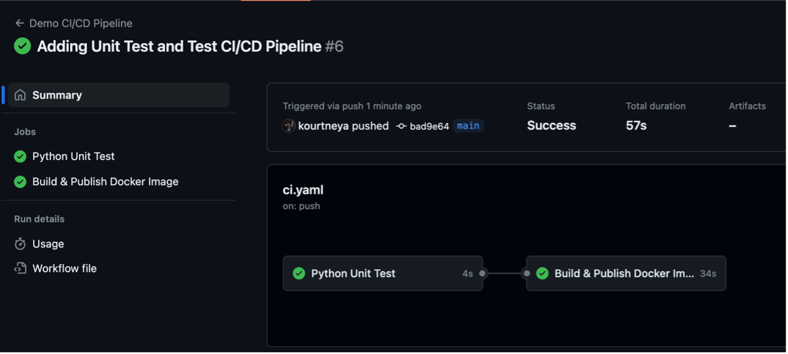

# Task 8 - GitHub Actions Test Pipeline
As mentioned in the previous [task](task_7.md), unit tests are essential for verifying that chunks of code are functioning correctly, assist with identifying bugs or vulnerabilities, and catching breaking changes. 
In CI/CD, these unit tests play a critical role by acting as a safety net to ensure every new code that has been merged does not introduce breaking changes and will prevent the automated pipeline from continuing further. Not only does the CI/CD assist with improving the quality, it also speeds up development and increase the confidence that software delivery can be delivered frequently and reliably. 

In CI/CD, the typical pipeline follows an order starting with the build job followed by test job then the deployment job. There is no limit to the number of jobs you may have nor is there a requirement that the jobs follow this order, however, it is recommended and best practice to follow a similar pattern. In this lab, the pipeline will be unconventional because the test job will occur before the build job. The reason for this is because in python there is no compiling of the code which usually happen in the build job. So before you build the docker image, test that the code passes all tests before packaging it in a docker image. 

!!! info
    It is worth to mention that building the docker image could be its own job aside from build. Thus you would have the build job that compiles the code, test job that executes the unit tests, package job that packages the application in an artifact, and deployment job that delivers the application to a delivery system. 

## Step 1: Open the CI/CD Workflow File
All jobs are within the same file. While you may have multiple workflow files, each file should serve different purposes. For this lab, you are creating a CI/CD pipeline for the software development lifecycle of the application which all jobs will be in the same workflow file. Open the `ci.yaml` file in Visual Studio Code. 

1. In Visual Code, click on the `.github/workflows` folder
2. Click the `ci.yaml` file. The contents of the file should be showing in the editor

## Step 2: Define the Test Job
In CI/CD, the typical pipeline follows an order starting with the build job followed by test job then the deployment job. There is no limit to the number of jobs you may have nor is there a requirement that the jobs follow this order, however, it is recommended and best practice to follow a similar pattern. In this lab, the pipeline will be unconventional because the test job will occur before the build job. The reason for this is because in python there is no compiling of the code which usually happen in the build job. So before you build the docker image, test that the code passes all tests before packaging it in a docker image. 

!!! info
    It is worth to mention that building the docker image could be its own job aside from build. Thus you would have the build job that compiles the code, test job that executes the unit tests, package job that packages the application in an artifact, and deployment job that delivers the application to a delivery system. 

1. Create a new job called `test` under the `jobs` section before the build job
    ```{.yaml hl_lines="6 7 8"}
    name: CLUS GitHub Actions Demo 

    ...

    jobs:
        test:
            name: Python Unit Test
            runs-on: ubuntu-latest
        build: 
            ...
    ```

2. If you are interacting with the code, in almost every job you will need to checkout the repository. There are ways to pass artifacts from job to job but in this case you need the entire code base. It's just easier to checkout the code to perform tasks against the files within it. Use the `actions/checkout@v4` action in a new step under a `steps` section to checkout the code in the repository

    ```{.yaml hl_lines="5 6 7"} 
    jobs:
        test:
            name: Python Unit Test
            runs-on: ubuntu-latest
            steps: 
            - name: Checkout Repository
              uses: actions/checkout@v4
    ```

3. Remember, GitHub Actions run each job in a runner environment which is either a virtual machine or a container. This virtual environment needs the tools and/or dependencies to execute the task. As of right now, the runner is a basic ubuntu image and does not have the python library to execute any python task. Create a step using the `actions/setup-python@v5` action to install python within the virtual environment. Also, use the `with` key to specify the parameter for the python version

    ```{.yaml hl_lines="8 9 10 11"} 
    jobs:
        test:
            name: Python Unit Test
            runs-on: ubuntu-latest
            steps: 
            - name: Checkout Repository
              uses: actions/checkout@v4
            - name: Setting up Python
              uses: actions/setup-python@v5
              with: 
                python-version: '3.12'
    ```

4. Now that python has been install into the virtual environment, the python application you created has a dependency using the Flask framework that will standup a webserver for the health API endpoint. Create a step that will install the necessary dependencies listed in the `requirement.txt` file

    ```{.yaml hl_lines="7 8 9"} 
    jobs:
        test:
            name: Python Unit Test
            runs-on: ubuntu-latest
            steps: 
            ...
            - name: Install dependencies
              run: |
                pip install -r requirements.txt --break-system-packages
    ```

    - In all of the previous steps you created, you have used actions to perform a task. In this step, the `run` command is used to perform the task. The `run` command execute the shell commands that is defined. 

5. Just like you have done in the local environment, use the `run` command in a new step to execute the python unit test 

    ```{.yaml hl_lines="7 8 9"} 
    jobs:
        test:
            name: Python Unit Test
            runs-on: ubuntu-latest
            steps: 
            ...
            - name: Executing Unit Test
              run: |
                python -m unittest discover -v
    ```

6. By default, GitHubActions runs all jobs in parallel unless instructed not to do so. To run jobs in a sequential order, update the `build` job to **depend** on the `test` job using the `needs` keyword

    ```{.yaml hl_lines="14"}
    name: CLUS GitHub Actions Demo 

    ...

    jobs:
        test:
            name: Python Unit Test
            runs-on: ubuntu-latest
            steps:
            ...
        build: 
            name: Build & Publish Docker Image
            runs-on: ubuntu-latest
            needs: test
            permissions:
                ...
    ```

7. Here is the complete updated workflow file that includes both the `test` and `build` jobs 

    ```yaml 
    name: CLUS GitHub Actions Demo 

    on: 
        push:
            branches:
                - main

    env:
        APP_NAME: '${{ github.repository }}'
        REGISTRY: ghcr.io

    jobs:
        test:
            name: Python Unit Test
            runs-on: ubuntu-latest
            steps: 
            - name: Checkout Repository
              uses: actions/checkout@v4
            - name: Setting up Python
              uses: actions/setup-python@v5
              with: 
                python-version: '3.12'
            - name: Install dependencies
              run: |
                pip install -r requirements.txt --break-system-packages
            - name: Executing Unit Test
              run: |
                python -m unittest discover -v
        build:
            name: Build & Publish Docker Image
            runs-on: ubuntu-latest
            needs: test
            permissions:
                contents: read
                packages: write
            outputs:
                image-tag: '${{ steps.meta.outputs.tags }}'
            steps:
            - name: Checkout Repository
              uses: actions/checkout@v4
            - name: Login to Container Registry 
              uses: docker/login-action@v3
              with:
                registry: '${{ env.REGISTRY }}'
                username: '${{ github.actor }}'
                password: '${{ secrets.GITHUB_TOKEN}}'
            - name: Extract metadata for Docker
              id: meta
              uses: docker/metadata-action@v4
              with: 
                images: '${{ env.REGISTRY }}/${{ env.APP_NAME }}'
                tags: | 
                    type=sha, format=short
            - name: Build & Publish Docker Image to GitHab Package
              uses: docker/build-push-action@v5
              with: 
                context: . 
                push: true
                tags: '${{ steps.meta.outputs.tags}}'
                labels: '${{ steps.meta.outputs.labels}}'
    ```

## Step 3: Save the Workflow File
Save the file by clicking save in the File toolbar option, or by using keyboard shortcuts 

- MacOS

    <kbd>Command</kbd> + <kbd>S</kbd> 

- Windows

     <kbd>Ctrl</kbd> + <kbd>S</kbd>

## Step 4: Add Files to Staging Area
Back in the terminal, add the new file(s) to the git staging area to be prepared to send to the GitHub repository. Execute the following command to add all files to the staging area 

```bash
git add . 
```

## Step 5: Commit Changes 
Once all files have been added to the staging area, its now time to commit that changes in the staging area. The `git commit -m "message"` command will create a snapshot of the files the files in the staging area. The snapshot will be identified with a unique identifier called a **commit hash**. This hash will be used when tagging the docker image in the build step. To commit the files in the staging are execute the following command

```bash
git commit -m "Adding Unit Test and Test CI/CD Pipeline"
```

## Step 17: Push Commit to GitHib Repository
Execute the command below to upload your local changes to GitHub

```bash
git push origin main
```

## Step 18: View GitHub Action Status
Navigate to the repository in GitHub and click on the `Actions` tab on the GitHub tool bar. Click on the latest workflow to view status. Notice how the `Build & Publish Docker Image` doesn't start until the `Python Unit Test` job finishes. A green check should be visible on `Python Unit Test` and `Build & Publish Docker Image` when both are complete.
    <figure markdown>
      { width="880" }
    </figure>

## Step 19: Verify Docker Image in Packages
On the main page that is the **Code** tab of the repository, at the right side of the page you should see an image underneath `Packages`. 
    <figure markdown>
      { width="880" }
    </figure>

!!! note
    The name of the image underneath Packages should be the name of your repository.

<br>

**Congratulations:** You have now created a CI Pipeline with build and test tasks.

<br>