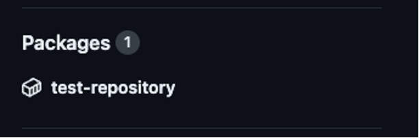
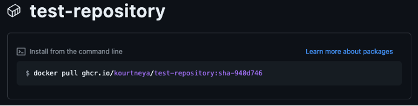
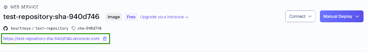

# Task 9 - Render Environment
Before your CI/CD pipeline can execute the Continuous Delivery/Deployment (CD) part, you need to have an environment to deploy and run the docker container. Render is a cloud hosting platform that allows developers to quickly deploy applications without the complexities of setting up cloud services and infrastructure. Render offers a variety of plans that are tailored to various needs. The more compute, storage, collaboration, and other advance features that needed the pricing plan will increase. For this lab, the free tier will suffice. 

## Step 1: Render Account 
To create or login to the Render account follow these steps. 

1. Navigate to the Render Website by clicking the hyper link or typing [https://render.com](https://render.com) into your web browser.

2. On the homepage, click the `Sign In` button at the top right corner of the webpage
    - If you already have an account, sign In with either the social login options or email and password
    - If you **DO NOT** have an account, click the `Sign Up` link below the `Sign In` button. Create the account either using social login or provide an email and password
        - If requested, Render may send an email to the email address specified for verification. Login to your email account and follow the instructions for verification.

## Step 2: Create an API Key
API Keys functions much like a password. It is used to securely interact with third-party applications or platforms programmatically. Having an API Key is extremely important in CI/CD pipelines so that the automation can communicate with the third-party application to send data or trigger another workflow. It's also important to keep the API Key private and secured because exposing it would allow malicous attackers to harm your environment. Creating an API Key in Render will allow GitHub Actions to trigger a deployment when it sends the new docker image to the environment. Follow these steps to create an API Key in Render Cloud. 

1. After successfully logging into the Render Account, click on your profile in the top right corner of the webpage and click the `Account Settings` option from the drop down menu

2. On the Settings page, click `API Keys` in the left side bar. 

3. Click `Create API Key` button and enter a name for the API Key in the pop up and click `Create API Key`

4. The API Key will be displayed and this will be the only time it will be displayed. Copy and store the key somewhere as you will use this later in the lab. Once copied, click `Done`

## Step 3: Create New Web Service
In Render a Web Service is a type of deployment that will continue to run until instructed to end. This is suitable for the python application you have created because of its RESTful API nature. 

1. To create a service, click `New +` at the top right corner next to your profile. Then click `Web Service`

2. On the `Create a Web Service` page, choose the `Deploy an existing image from a registry` option, then click `Next`

3. In previous tasks, you have created CI/CD pipeline that build and published a docker image. In a new tab in your browser, navigate to your repository in GitHub. On the right side bar of the repository page, click the container name that is specified under `Packages`
    <figure markdown>
      { width="880" }
    </figure>

4. Copy the image URL specified in the docker command shown. *(e.g. “ghcr.io/kourtneya/test-repository:sha- 940d746”)*
    <figure markdown>
        { width="880" }
    </figure>

5. Navigate back to the Render browser tab and for the `Image URL` on the `Deploy an image` form, paste the image URL you copied from GitHub. Then click `Next`.

6. Select the instance type of `Free`, then click the `Create Web Service` button at the bottom of the page.

## Step 4: Copy the Service ID
Before moving on to view the python application in the browser, let's get some other details you will need for the deployment step in your CI/CD pipeline. Much like other tools everytime you create something there will always be some reference to associate that "thing". When you created the Web Service in Render, this web service now has its own reference ID. This ID will be used in the CI/CD pipeline to instruct the task to interact with this specific Web Service in Render. 

- To copy the reference ID in for this Web Service, in the URL of the Render browser tab, the reference ID will start with **`srv-`** and end at the next **`/`** in the web address. For example, 
<br> `https://dashboard.render.com/web/`**srv-coogbeev3ddc738ns11g**`/deploys/dep-`

## Step 5: Verify Deployment 
When the web service is deployed and ready for the viewing, a green label with the text `Live` will be presented
    <figure markdown>
        { width="880" }
    </figure>

## Step 6: Visit the Python Application in Browser
1. Underneath the web service name is the URL to the python application. Click the URL. The first page will be `Not Found`. This is because our python application does not have a route to the root path
    <figure markdown>
        { width="880" }
    </figure>


2. To view the health, at the end of the URL type `/health`, then press Enter. You will see the JSON response

    ```json
    {
        "status": "OK"
    }
    ```

<br>

**Congratulations:** You have created a Render environment with your docker application deployed

<br>